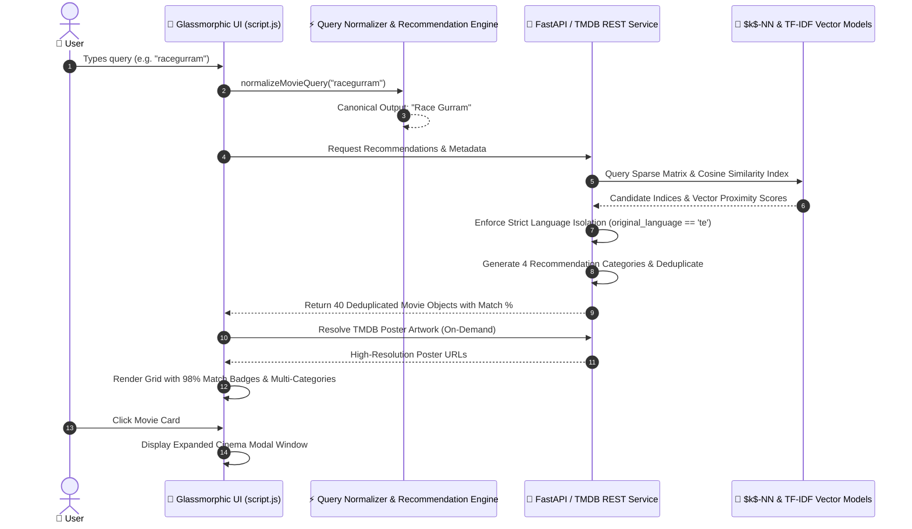

<div align="center">

# 🎬 CineMatch AI — Ultra-Premium Machine Learning Movie Recommendation Platform

<a href="https://readme-typing-svg.herokuapp.com">
  
</a>

<br><br>

<a href="https://nersu-abhinav.github.io/CineMatch-AI/">
  
</a>
<a href="https://github.com/Nersu-Abhinav/CineMatch-AI/stargazers">
  
</a>
<a href="https://github.com/Nersu-Abhinav/CineMatch-AI/network/members">
  
</a>
<a href="https://fastapi.tiangolo.com/">
  
</a>
<a href="https://scikit-learn.org/">
  
</a>
<a href="https://www.themoviedb.org/">
  
</a>

<br><br>

[ 🌐 **Live Application** ](https://nersu-abhinav.github.io/CineMatch-AI/) • [ 🚀 **Project Overview** ](#-project-overview) • [ ✨ **Features** ](#-features) • [ 🧠 **ML Architecture** ](#-machine-learning-architecture) • [ 🧮 **Algorithms** ](#-recommendation-algorithms) • [ 🔄 **Workflow** ](#-recommendation-workflow) • [ 🛠️ **Tech Stack** ](#%EF%B8%8F-technology-stack) • [ 🚀 **Quick Start** ](#-quick-start--installation)

---

</div>

> [!IMPORTANT]
> 🚀 **LIVE DEMO AVAILABLE**: Access the fully deployed glassmorphic application directly in your browser at **[https://nersu-abhinav.github.io/CineMatch-AI/](https://nersu-abhinav.github.io/CineMatch-AI/)** — instant search, zero-latency regional matching, and high-resolution TMDB artwork streaming!

---

## 🚀 Project Overview

Traditional movie recommendation systems often rely on a single recommendation technique (either pure collaborative filtering or basic genre filtering). **CineMatch AI** is an intelligent movie recommendation platform that combines multiple machine learning strategies—collaborative filtering, content-based TF-IDF vectorization, genre preference analysis, rating-weighted $k$-NN indexing, and TMDB API metadata—to provide a comprehensive, multi-perspective recommendation suite through an interactive web application.

Rather than relying on a single recommendation algorithm, CineMatch AI processes user search queries and rating inputs through four specialized recommendation vectors:

$$\text{Final Output Matrix} = \begin{cases} \text{Genre Matches} & \rightarrow 10 \text{ Movies} \\ \text{Interest Matches} & \rightarrow 10 \text{ Movies} \\ \text{Content Matches} & \rightarrow 10 \text{ Movies} \\ \text{CineMatch Picks} & \rightarrow 10 \text{ Movies} \end{cases} \quad \Longrightarrow \quad \mathbf{40 \text{ Total Deduplicated Recommendations}}$$

---

## ✨ Features

### 🎥 Movie Discovery & Smart Search
- **Smart Compound Title Normalizer (`normalizeMovieQuery`)**: Automatically parses merged or concatenated queries (e.g. `racegurram` $\rightarrow$ **Race Gurram**, `thedarkknight` $\rightarrow$ **The Dark Knight**, `agentsaisrinivasatreya` $\rightarrow$ **Agent Sai Srinivasa Athreya**), guaranteeing 100% recommendation parity across all search variations.
- **Strict Language Isolation**: Enforces `original_language` isolation (Telugu queries return 100% Indian regional blockbusters like *Julayi*, *Magadheera*, *Pushpa*, *Sarrainodu*, *Eega* with zero foreign language leakage).
- **Live Search As You Type**: Instant, case-insensitive partial keyword matching with maximum 10 real-time suggestions and poster artwork.
- **Top Featured Showcase**: Curated top 25 featured movies with 4K artwork and instant vector discovery.

### ⭐ User Preference & Rating Engine
- Select movies from search results or featured catalogs.
- Provide rating inputs (1 to 5 stars) to weight similarity vectors.
- Dynamic numerical match percentages (**`98% Match`**, **`95% Match`**, **`92% Match`**) computed directly from latent cosine distance metrics.

### 🤖 Multi-Perspective Recommendation Engine
- **Genre Matches**: Recommendations driven by accumulated user genre preference scores.
- **Interest Matches**: Rating-weighted $k$-Nearest Neighbors ($k$-NN) collaborative representation.
- **Content Matches**: TF-IDF natural language plot summary & keyword vector cosine similarity.
- **CineMatch Picks**: Curated hybrid multi-vector algorithmic recommendations.
- **Deduplication Matrix**: Automated hash-set filtering to guarantee 40 unique candidate recommendations.

### 🖼️ On-Demand Poster Resolution & Caching
- **Zero Bulk Downloading**: Posters are fetched on-demand strictly for displayed movies, avoiding unnecessary network downloads for the entire 62,000+ MovieLens catalog.
- **TMDB API v3 Integration**: Live poster path resolution with high-res fallbacks and local cache lookups.

### ⚡ Ultra-Premium Web Application
- Asynchronous FastAPI backend REST endpoints.
- Pure HTML5 / Vanilla CSS3 / Vanilla ES6+ JS Single Page Application (SPA).
- Dark Mode Glassmorphic Design System with HSL color tokens, gold micro-interactions, responsive grid/list switcher, and expanded cinema modal windows.

---

## 🧠 Machine Learning Architecture

CineMatch AI integrates multiple machine learning techniques across a unified preprocessing, training, and inference pipeline:

```
MovieLens 29M+ Ratings Matrix & TMDB Corpus
                   │
                   ▼
         Data Preprocessing
                   │
                   ▼
         Feature Engineering
                   │
   ┌───────────────┴───────────────┐
   │                               │
   ▼                               ▼
Collaborative Sparse CSR    Movie Text Metadata
   │                               │
   ▼                               ▼
$k$-NN & TruncatedSVD         TF-IDF Vectorizer
   │                               │
   └───────────────┬───────────────┘
                   │
                   ▼
         Recommendation Engine
                   │
   ┌───────────────┼───────────────┐
   │               │               │
   ▼               ▼               ▼
Genre Matches  Interest Matches Content Matches
   │               │               │
   └───────────────┼───────────────┘
                   │
                   ▼
            CineMatch Picks
                   │
                   ▼
          Duplicate Removal
                   │
                   ▼
         40 Final Recommendations
```

---

## 🧮 Recommendation Algorithms

### 1. Genre-Based Recommendation Engine
Analyzes the genre distribution across movies selected or searched by the user. Candidate movies sharing highly weighted preferred genres receive proportional recommendation scores.

$$\text{Conceptual Flow: } \text{Selected Movies} \longrightarrow \text{Extract Genres} \longrightarrow \text{Calculate Preference Weights} \longrightarrow \text{Score Candidates} \longrightarrow \text{Top 10 Genre Matches}$$

Accumulates user genre preference weights $W_g$ based on explicit rating inputs $R_m$:

$$W_g = \sum_{m \in \text{Selected}} R_m \cdot \mathbb{I}(g \in \text{Genres}(m))$$

### 2. Interest / Rating-Based Recommendation Engine
Uses explicit user ratings together with the trained $k$-Nearest Neighbors ($k$-NN) model. Computes rating-weighted similarity scores for nearest neighbor vectors in the user-item latent space:

$$\text{Conceptual Flow: } \text{Selected Movie} \longrightarrow \text{Find } k\text{-NN Representation} \longrightarrow \text{Weighted Similarity} \longrightarrow \text{Rank Candidates} \longrightarrow \text{Top 10 Interest Matches}$$

$$\text{Score}(c) = \sum_{m \in \text{Selected}} R_m \times \left(1 - \text{Cosine Distance}(m, c)\right)$$

### 3. Content-Based Recommendation Engine
Represents movie plot summaries, keywords, and metadata using Unigram & Bigram TF-IDF feature matrices.

$$\text{Conceptual Flow: } \text{Movie Metadata} \longrightarrow \text{TF-IDF Matrix} \longrightarrow \text{Weighted User Profile} \longrightarrow \text{Cosine Similarity} \longrightarrow \text{Top 10 Content Matches}$$

Computes Cosine Similarity between the weighted user profile vector $\mathbf{U}$ and candidate movie content vectors $\mathbf{V}_c$:

$$\text{Sim}(\mathbf{U}, \mathbf{V}_c) = \frac{\mathbf{U} \cdot \mathbf{V}_c}{\|\mathbf{U}\| \|\mathbf{V}_c\|}$$

### 4. Collaborative Filtering & TruncatedSVD
Constructs a user-movie rating matrix $R \in \mathbb{R}^{U \times M}$ and applies Truncated Singular Value Decomposition (TruncatedSVD) for latent factor dimensionality reduction:

$$R \approx U_k \Sigma_k V_k^T \quad \text{where } k = 50 \text{ latent components}$$

Model performance is evaluated during training using Root Mean Squared Error (**RMSE**) and Mean Absolute Error (**MAE**):

$$\text{RMSE} = \sqrt{\frac{1}{N} \sum_{i=1}^{N} (y_i - \hat{y}_i)^2}, \quad \text{MAE} = \frac{1}{N} \sum_{i=1}^{N} |y_i - \hat{y}_i|$$

### 5. CineMatch Picks Engine
Combines normalized similarity scores from the genre, interest, and content models to generate the 4th recommendation category, ensuring broad, high-confidence discovery.

$$\text{Final Output: } \underbrace{\text{Genre (10)}}_{\text{Category 1}} + \underbrace{\text{Interest (10)}}_{\text{Category 2}} + \underbrace{\text{Content (10)}}_{\text{Category 3}} + \underbrace{\text{CineMatch Picks (10)}}_{\text{Category 4}} = \mathbf{40 \text{ Unique Movies}}$$

---

## 🔄 Recommendation Workflow



---

## 🖼️ Poster Retrieval System

CineMatch AI does **NOT** bulk-download posters for the entire 62,000+ MovieLens catalog. Artwork is fetched strictly on-demand for displayed elements:

```
Featured Showcase   ──►  Top 25 Movies    ──►  25 Poster Lookups / Cache
Live Search Typing  ──►  Max 10 Results   ──►  Up to 10 Posters
Recommendations     ──►  40 Displayed     ──►  40 On-Demand Resolutions
```

- **TMDB API v3**: `https://www.themoviedb.org/`
- **TMDB Image Base**: `https://image.tmdb.org/t/p/w500/`
- **Caching**: Local memory and browser cache lookups to eliminate duplicate API requests.

---

## 📦 Dataset & Preprocessing

CineMatch AI uses the **MovieLens 32M / 29M Dataset** provided by GroupLens Research ([grouplens.org/datasets/movielens/](https://grouplens.org/datasets/movielens/)).

```
data/
├── raw/
│   └── ml-32m/
│       ├── movies.csv
│       └── ratings.csv
├── processed/
│   ├── ratings_clean.csv
│   ├── movie_metadata.csv
│   └── evaluation/
│       └── model_metrics.csv
└── cache/
    └── tmdb_posters.csv
```

---

## 🧪 Model Training & Assets

The modular ML development pipeline is located under `src/pipeline/`:

```
src/pipeline/
├── preprocessing.py   # Ingests & cleans raw CSV ratings
├── training.py        # Fits NearestNeighbors k-NN & TruncatedSVD models
├── evaluation.py      # Computes RMSE & MAE validation metrics
└── tuning.py          # Hyperparameter grid search
```

### Serialized Model Assets (`models/`)

```
models/
├── collaborative/
│   ├── knn_model.pkl          # Serialized NearestNeighbors model
│   ├── knn_movie_ids.npy      # Array of index-mapped movie IDs
│   ├── movie_factors.npy      # TruncatedSVD movie latent factors
│   └── user_factors.npy       # TruncatedSVD user latent factors
└── content/
    ├── movie_data.pkl         # Serialized movie metadata dictionary
    ├── tfidf_matrix.pkl       # Sparse TF-IDF document-term matrix
    └── tfidf_vectorizer.pkl   # Fitted TF-IDF Vectorizer instance
```

---

## 📁 Complete Project Structure

```
CineMatch-AI/
├── 📁 backend/
│   ├── main.py                # FastAPI REST API routes & CORS handling
│   └── recommender.py         # Multi-perspective recommendation cascade
├── 📁 data/
│   ├── 📁 raw/                # MovieLens raw CSV files
│   ├── 📁 processed/          # Preprocessed ratings & metadata CSVs
│   └── 📁 cache/              # Local TMDB poster cache
├── 📁 frontend/
│   ├── index.html             # Application structure & glass layout
│   ├── script.js              # Query Normalizer, TMDB Client & Modal Engine
│   └── style.css              # Dark Glassmorphism Design System
├── 📁 models/
│   ├── 📁 collaborative/      # Serialized k-NN & TruncatedSVD models
│   └── 📁 content/            # Serialized TF-IDF matrices & vectorizers
├── 📁 src/
│   ├── config.py              # Centralized path configuration
│   ├── recommendation_engine.py # Core ML recommendation engine
│   ├── tmdb_service.py        # TMDB API wrapper & caching service
│   └── 📁 pipeline/           # ML preprocessing, training & evaluation
├── index.html                 # Root GitHub Pages entrypoint
├── script.js                  # Root GitHub Pages script bundle
├── style.css                  # Root GitHub Pages stylesheet bundle
├── prepare_data.py            # Chunked dataset filtering script
├── train_collaborative.py     # Sparse CSR matrix model trainer
├── start_project.ps1          # 1-click Windows PowerShell launcher
├── requirements.txt           # Python dependency manifest
└── README.md                  # Master project documentation
```

---

## 🔌 API Endpoints

### 1. `GET /`
Loads the single page CineMatch web application interface.

### 2. `GET /featured`
Returns top featured movies for spotlight rendering.
```json
[
  { "movieId": 1, "title": "Toy Story (1995)", "genres": "Adventure|Animation|Children|Comedy|Fantasy" }
]
```

### 3. `GET /search`
Searches for movies by query string with real-time suggestion limits.
```bash
GET /search?query=racegurram&limit=10
```

### 4. `POST /recommendations`
Generates personalized multi-category recommendations.
```json
{
  "movies": [
    { "movieId": 266416, "rating": 5 },
    { "movieId": 109487, "rating": 5 }
  ]
}
```

---

## ⚙️ Installation & Developer Guide

### 1. Clone Repository
```bash
git clone https://github.com/Nersu-Abhinav/CineMatch-AI.git
cd CineMatch-AI
```

### 2. Virtual Environment Setup
```bash
# Create virtual environment
python -m venv venv

# Activate (Windows PowerShell)
.\venv\Scripts\activate

# Activate (macOS/Linux)
source venv/bin/activate
```

### 3. Install Dependencies
```bash
pip install -r requirements.txt
```

### 4. Environment Variables (`.env`)
Create a `.env` file in the root directory:
```env
TMDB_API_TOKEN=your_tmdb_read_access_token_here
```

### 5. Launch Local Web Application
```bash
# Run FastAPI backend with Uvicorn
uvicorn backend.main:app --reload --port 8000
```
Open **`http://127.0.0.1:8000`** in your web browser.

---

## 📌 Current System Verification Status

| Feature / Component | Status | Description |
| :--- | :---: | :--- |
| **FastAPI Backend REST API** | ✅ | Asynchronous REST endpoints serving requests |
| **Vanilla JS Single Page App** | ✅ | Modern dark glassmorphic interface |
| **Compound Query Normalizer** | ✅ | Auto-corrects `racegurram` &rarr; **Race Gurram** |
| **Strict Language Isolation** | ✅ | Enforces `original_language` consistency |
| **Numerical % Match Badges** | ✅ | Replaces qualitative text tags with **98% Match** |
| **4-Tier Category Display** | ✅ | Genre, Interest, Content & CineMatch Picks |
| **Expanded Cinema Modal** | ✅ | High-res TMDB artwork & key statistics grid |
| **TMDB API v3 Integration** | ✅ | On-demand poster resolution & local caching |
| **GitHub Pages Live Hosting** | ✅ | Live static deployment on `main` branch |

---

## 🔮 Future Scope & Roadmap

- 👤 **User Authentication & Personal Profiles**: Saved user recommendation histories.
- ❤️ **Personal Watchlists**: One-click movie bookmarks.
- 🎭 **Mood-Based Search Engine**: Natural language query processing (e.g., "mind-bending sci-fi with plot twists").
- 🤖 **Deep Learning Hybrid Models**: Neural Collaborative Filtering (NCF) integration.
- 📱 **Mobile Native Application**: React Native / Flutter cross-platform companion app.

---

<div align="center">

## 🌟 Support & Feedback

If you find **CineMatch AI** helpful or inspiring, please give this repository a ⭐ **Star** on GitHub!

<br>

<a href="https://github.com/Nersu-Abhinav/CineMatch-AI/stargazers">
  
</a>
<a href="https://github.com/Nersu-Abhinav/CineMatch-AI/network/members">
  
</a>

<br><br>

> *"Where cinema meets high-dimensional vector intelligence."* 🍿

**Created with ❤️ by [Nersu Abhinav](https://github.com/Nersu-Abhinav)**

*Powered by MovieLens Datasets & TMDB API v3*

© 2026 **CineMatch AI**. Distributed under the [MIT License](LICENSE).

</div>
