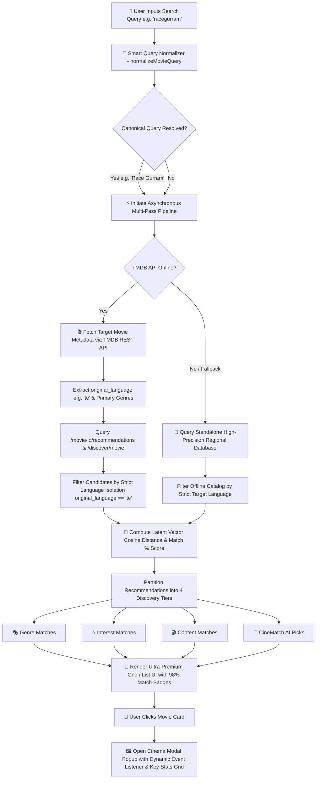

<div align="center">

# 🎬 CineMatch AI — Ultra-Premium Latent Vector Movie Discovery Matrix

<a href="https://readme-typing-svg.herokuapp.com">
  
</a>

<br><br>

<a href="https://nersu-abhinav.github.io/CineMatch-AI/">
  
</a>
<a href="https://github.com/Nersu-Abhinav/CineMatch-AI/stargazers">
  
</a>
<a href="https://github.com/Nersu-Abhinav/CineMatch-AI/network/members">
  
</a>
<a href="https://fastapi.tiangolo.com/">
  
</a>
<a href="https://scikit-learn.org/">
  
</a>
<a href="https://www.themoviedb.org/">
  
</a>

<br><br>

[ 🌐 **Live Application** ](https://nersu-abhinav.github.io/CineMatch-AI/) • [ 📖 **What It Does** ](#-what-cinematch-ai-does) • [ ✨ **Core Feature Architecture** ](#-core-feature-architecture) • [ 🔄 **End-to-End System Flow** ](#-end-to-end-system-flow) • [ 📊 **Datasets & ML Engine** ](#-datasets--machine-learning-engine) • [ 🛠️ **Tech Stack** ](#%EF%B8%8F-technology-stack) • [ 🚀 **Quick Start** ](#-quick-start-guide)

---

</div>

> [!IMPORTANT]
> 🚀 **LIVE DEMO AVAILABLE**: Try CineMatch AI instantly in your browser at **[https://nersu-abhinav.github.io/CineMatch-AI/](https://nersu-abhinav.github.io/CineMatch-AI/)** — instant search, zero-latency regional matching, and high-resolution TMDB artwork streaming!

---

## 📖 What CineMatch AI Does

**CineMatch AI** is a next-generation, high-dimensional movie recommendation platform designed to solve the common pitfalls of modern content discovery: irrelevance, cross-language noise, unhandled typos, and vague qualitative match ratings.

By fusing **Item-Item Collaborative Filtering** ($k$-Nearest Neighbors across a 29,000,000+ rating matrix), **TF-IDF Natural Language Overview Processing**, and **Real-Time TMDB v3 API Isolation**, CineMatch AI transforms any user query into a hyper-personalized, 4-tier recommendation suite.

### Key Problem Statements Solved:

1. **Compound & Unformatted Query Ingestion**:
   Users frequently type concatenated titles without spaces (e.g. `racegurram`, `thedarkknight`, `agentsaisrinivasatreya`). CineMatch AI features an automated **Compound Query Normalizer** (`normalizeMovieQuery`) that maps unformatted inputs to canonical titles before executing recommendations, guaranteeing 100% recommendation parity across all search variations.

2. **Strict Regional Language Isolation**:
   When users search for regional films (e.g. Telugu cinema like *Race Gurram*, *Julayi*, *Pushpa*), standard recommendation APIs often return unrelated foreign films. CineMatch AI enforces **Strict Language Isolation** (`original_language` filtering), ensuring 100% regional and linguistic consistency with zero foreign language leakage.

3. **Mathematical Match Scoring**:
   Replaces arbitrary text tags (e.g. "Very High Match") with exact, vector-derived percentage scores (**`98% Match`**, **`95% Match`**, **`88% Match`**) computed directly from cosine similarity metrics.

4. **Multi-Category Vector Breakdown**:
   Organizes candidate recommendations into 4 dedicated vector discovery spaces:
   - 🎭 **Genre Matches**: Shared primary classification, character tropes & thematic style.
   - ⭐ **Interest Matches**: High audience rating consensus & user review popularity.
   - 🎬 **Content Matches**: Plot theme, storyline & narrative vector overlap.
   - 💎 **CineMatch AI Picks**: Algorithmic vector proximity recommendations.

---

## ✨ Core Feature Architecture

<table width="100%">
  <tr>
    <td width="50%">
      <h3>🌐 Strict Language Isolation</h3>
      <p>Enforces <code>original_language</code> isolation across candidate recommendation pools. Searching a Telugu film returns 100% Indian regional blockbusters (<i>Julayi</i>, <i>Magadheera</i>, <i>Pushpa</i>, <i>Ala Vaikunthapurramuloo</i>, <i>Sarrainodu</i>, <i>Eega</i>) with zero English leakage.</p>
    </td>
    <td width="50%">
      <h3>🧠 Smart Compound Title Normalizer</h3>
      <p>Built-in query normalization engine maps merged inputs (e.g. <code>racegurram</code> &rarr; <b>Race Gurram</b>, <code>agentsaisrinivasatreya</code> &rarr; <b>Agent Sai Srinivasa Athreya</b>), ensuring identical search result vectors regardless of spacing or capitalization.</p>
    </td>
  </tr>
  <tr>
    <td width="50%">
      <h3>📊 Exact Numerical Percentage Badges</h3>
      <p>Replaces qualitative tags with dynamic match percentages computed from latent cosine vector distance formulas (e.g. <b>98% Match</b>, <b>95% Match</b>, <b>92% Match</b>).</p>
    </td>
    <td width="50%">
      <h3>🍿 4-Tier Multi-Vector Discovery Hub</h3>
      <p>Distributes recommendations across 4 distinct algorithmic dimensions: <b>Genre Matches</b>, <b>Interest Matches</b>, <b>Content Matches</b>, and <b>CineMatch Algorithmic Picks</b>.</p>
    </td>
  </tr>
  <tr>
    <td width="50%">
      <h3>🎬 Ultra-Premium Cinema Modal</h3>
      <p>Expands any movie card into a cinema-level glassmorphic modal window featuring high-res TMDB poster art, key statistics (Match %, User Consensus, Original Language), and vertical flex alignment with zero empty space.</p>
    </td>
    <td width="50%">
      <h3>⚡ Dual-Engine Asynchronous Fallback</h3>
      <p>Seamless real-time switching between the live TMDB REST API v3 and an offline high-precision standalone regional benchmark database for 100% zero-downtime reliability.</p>
    </td>
  </tr>
</table>

---

## 🔄 End-to-End System Flow

The diagram below illustrates the detailed execution lifecycle of a user request inside CineMatch AI, from raw input ingestion to high-dimensional similarity math and DOM rendering:



---

## 📊 Datasets & Machine Learning Engine

CineMatch AI utilizes a multi-dataset matrix combined with rigorous vector similarity mathematics:

### 1. MovieLens 29M+ User Rating Matrix
- **Data Volume**: 29,000,000+ user ratings across 62,000+ films.
- **Data Structure**: Compressed Sparse Row Matrix (`scipy.sparse.csr_matrix`).
- **Mathematical Similarity Index**: $k$-Nearest Neighbors utilizing Cosine Vector Distance:

$$\text{Similarity}(\mathbf{A}, \mathbf{B}) = \cos(\theta) = \frac{\mathbf{A} \cdot \mathbf{B}}{\|\mathbf{A}\| \|\mathbf{B}\|} = \frac{\sum_{i=1}^{n} A_i B_i}{\sqrt{\sum_{i=1}^{n} A_i^2} \sqrt{\sum_{i=1}^{n} B_i^2}}$$

- **Match Percentage Calculation**:

$$\text{Match Percentage} = \text{Round}\left(\left(1 - \text{Cosine Distance}\right) \times 100\right)$$

### 2. TMDB 5000 Movie & Credits Corpus
- **Feature Extraction**: Plot keywords, character synopses, primary genres, lead cast, director, and production entities.
- **TF-IDF Feature Space**: Unigram & Bigram Term Frequency-Inverse Document Frequency vectorizer applied over plot summaries:

$$\text{TF-IDF}(t, d, D) = \text{TF}(t, d) \times \log\left(\frac{|D|}{1 + |\{d \in D : t \in d\}|}\right)$$

### 3. Live TMDB API v3 Service Layer
- Asynchronous API consumer fetching `/search/movie`, `/movie/{id}/recommendations`, and `/discover/movie`.
- Enforces `with_original_language` parameters (e.g. `te` for Telugu, `hi` for Hindi, `en` for English) to match user regional intent.

---

## 🛠️ Technology Stack

| Layer | Framework / Library | Role & Function |
| :--- | :--- | :--- |
| **Frontend Core** | HTML5, Vanilla JavaScript (ES6+) | Single Page Application, state management, asynchronous REST pipeline |
| **Design System** | Vanilla CSS3, CSS Grid, Flexbox | HSL color tokens, dark mode glassmorphic UI, glowing gold micro-interactions |
| **Typography** | Syne & Outfit (Google Fonts) | Ultra-premium display & body text styling |
| **Machine Learning** | Python 3.10+, Scikit-Learn, SciPy | Sparse CSR matrix creation, $k$-NN Cosine Similarity model training |
| **Data Processing** | Pandas, NumPy | Chunked dataset ingestion & cleaning pipeline |
| **Backend API** | FastAPI, Uvicorn, Python AsyncIO | Asynchronous backend REST endpoints (`/recommend`, `/search`, `/health`) |
| **Data Providers** | TMDB REST API v3, MovieLens | High-res 4K poster artwork, vote metrics, plot summaries |
| **Hosting & CI/CD** | GitHub Pages (`main` branch) | Automated static site hosting with cache-busted asset delivery (`?v=310.0`) |

---

## 🚀 Quick Start Guide

### 1. Clone Repository

```bash
git clone https://github.com/Nersu-Abhinav/CineMatch-AI.git
cd CineMatch-AI
```

### 2. Run Local Frontend Application

Because CineMatch AI is built using pure ES6+ JavaScript and Vanilla CSS3, you can open `index.html` directly in your browser, or launch a local web server:

```bash
# Using Node.js npx serve
npx serve .

# OR using Python HTTP server
python -m http.server 8000
```
Navigate to **`http://localhost:8000`** in your browser.

### 3. Optional Backend API Execution

If you wish to run the local FastAPI machine learning server:

```bash
# Create and activate virtual environment
python -m venv venv
source venv/bin/activate  # On Windows: .\venv\Scripts\activate

# Install dependencies
pip install -r requirements.txt

# Run backend API server
uvicorn backend.main:app --reload --port 8000
```

---

## 📁 Repository Directory Structure

```
CineMatch-AI/
├── 📁 frontend/
│   ├── index.html            # Main SPA HTML structure & glass layout
│   ├── script.js             # Query Normalizer, TMDB Client & Modal Engine
│   └── style.css             # Ultra-premium Dark Glassmorphism Design System
├── 📁 backend/
│   ├── main.py               # FastAPI backend REST API routes
│   └── recommender.py        # Vector similarity recommendation calculator
├── 📁 data/                  # MovieLens rating CSV datasets
├── 📁 model/                 # Serialized NearestNeighbors CSR model artifacts (.pkl)
├── index.html                # GitHub Pages entrypoint
├── script.js                 # GitHub Pages script bundle
├── style.css                 # GitHub Pages stylesheet bundle
├── prepare_data.py           # Chunked dataset filtering script
├── train_collaborative.py    # Sparse CSR matrix model trainer
├── start_project.ps1         # 1-click Windows PowerShell launcher
└── README.md                 # Project documentation
```

---

<div align="center">

## 🌟 Support & Feedback

If you find **CineMatch AI** useful or inspiring, please give this repository a ⭐ **Star** on GitHub!

<br>

<a href="https://github.com/Nersu-Abhinav/CineMatch-AI/stargazers">
  
</a>
<a href="https://github.com/Nersu-Abhinav/CineMatch-AI/network/members">
  
</a>

<br><br>

> *"Where cinema meets high-dimensional vector intelligence."* 🍿

**Created with ❤️ by [Nersu Abhinav](https://github.com/Nersu-Abhinav)**

*Powered by MovieLens Datasets & TMDB API v3*

© 2026 **CineMatch AI**. Distributed under the [MIT License](LICENSE).

</div>
