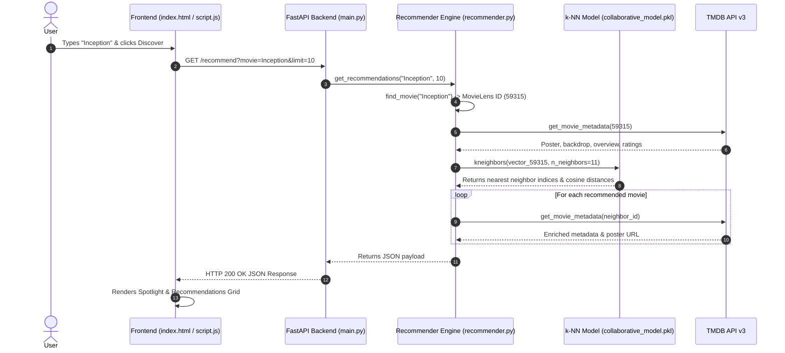

# 🎬 CineMatch AI — Next-Gen Movie Recommendation Engine


**CineMatch AI** is an end-to-end movie recommendation web application powered by **Item-Item Collaborative Filtering** (k-Nearest Neighbors over 29M+ ratings), real-time metadata & poster enrichment via **TMDB API v3**, a high-performance **FastAPI** backend, and a modern glassmorphic single-page frontend.

---

## ✨ Features

- ⚡ **Item-Item Collaborative Filtering**: High-dimensional vector space similarity powered by `scikit-learn` `NearestNeighbors(metric="cosine")`.
- 📊 **Chunked Data Pipeline**: Efficiently processes 29M+ MovieLens ratings down to top 5,000 catalog items without RAM exhaustion.
- 🎨 **Glassmorphic UI**: Ultra-premium dark-mode design with dynamic movie poster backdrops, ambient glows, and responsive layout grids.
- 🔍 **Flexible Discovery Controls**: Client-side sorting (Match score, TMDB rating, release year, title) and minimum rating/genre filters.
- ⚡ **Chain Discovery**: Click any movie card to instantly trigger new recommendations for that title.
- 🖼️ **TMDB Real-Time Enrichment**: Dynamic fetching of high-res posters, backdrops, plot overviews, ratings, and release dates.
- 🚀 **One-Click Automation**: Windows PowerShell launcher script to launch backend and frontend servers simultaneously.

---

## 🏗️ Architecture & Data Pipeline



---

## 🛠️ Tech Stack

- **Backend**: Python 3.10+, FastAPI, Uvicorn, Pandas, SciPy (Sparse CSR matrices), Scikit-Learn, Joblib, Requests, Python-Dotenv.
- **Frontend**: HTML5, Vanilla JavaScript (ES6+), Vanilla CSS (Custom tokens, Glassmorphism, Responsive CSS Grid/Flexbox).
- **APIs & Datasets**: TMDB API v3, MovieLens Ratings & Links Catalog.

---

## 🚀 Getting Started

### 1. Prerequisites
- Python 3.10 or higher
- A free TMDB API Read Access Token ([Get it from TMDB](https://www.themoviedb.org/settings/api))

### 2. Installation & Setup

1. **Clone the repository**:
   ```bash
   git clone https://github.com/Nersu-Abhinav/CineMatch-AI.git
   cd CineMatch-AI
   ```

2. **Create virtual environment & install dependencies**:
   ```bash
   python -m venv venv
   # On Windows:
   .\venv\Scripts\activate
   # On macOS/Linux:
   source venv/bin/activate

   pip install fastapi uvicorn pandas numpy scipy scikit-learn joblib requests python-dotenv
   ```

3. **Configure Environment Variables**:
   Copy `.env.example` to `.env` and paste your TMDB Read Access Token:
   ```bash
   cp .env.example .env
   ```
   Edit `.env`:
   ```env
   TMDB_API_TOKEN=your_tmdb_bearer_token_here
   ```

4. **Prepare Data & Train Model**:
   ```bash
   # Step 1: Filter raw ratings to top 5,000 catalog items
   python prepare_data.py

   # Step 2: Train Collaborative Filtering Nearest-Neighbors model
   python train_collaborative.py
   ```

5. **Run Application**:
   - **One-click launcher (Windows PowerShell)**:
     ```powershell
     .\start_project.ps1
     ```
   - **Manual start**:
     - Terminal 1 (Backend API):
       ```bash
       python -m uvicorn backend.main:app --reload --port 8000
       ```
     - Terminal 2 (Frontend Server):
       ```bash
       cd frontend
       python -m http.server 5500
       ```
     Open your browser to `http://127.0.0.1:5500`.

---

## 📁 Repository Structure

```
├── backend/
│   ├── main.py                # FastAPI routes & CORS setup
│   └── recommender.py         # Collaborative filtering inference engine
├── data/                      # Dataset files (movies.csv, links.csv)
├── frontend/
│   ├── index.html             # Application structure & markup
│   ├── script.js              # State management & dynamic UI logic
│   └── style.css              # Custom dark-mode glassmorphic styling
├── model/                     # Trained model artifacts (.pkl)
├── movie_metadata.py          # Bridges MovieLens IDs to TMDB API metadata
├── prepare_data.py            # Chunked data filtering pipeline
├── recommend_collaborative.py # CLI recommendation script
├── start_project.ps1          # One-click launcher script
├── tmdb.py                    # TMDB API v3 wrapper
├── train_collaborative.py     # NearestNeighbors model trainer
├── .env.example               # Environment variables template
└── .gitignore                 # Excluded large datasets & secrets
```

---

## 📜 License

Distributed under the MIT License. See `LICENSE` for details.
