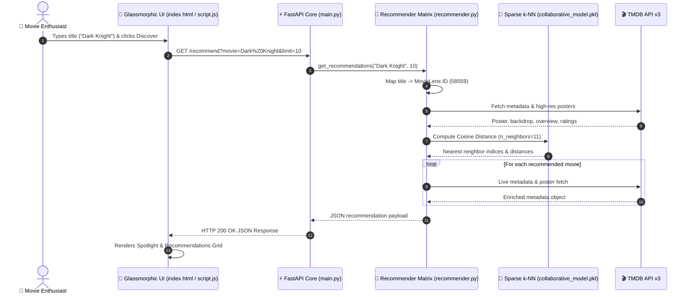

<div align="center">

# 🎬 CineMatch AI

<a href="https://readme-typing-svg.herokuapp.com">
  
</a>

<br><br>

[](https://nersu-abhinav.github.io/CineMatch-AI/)
[](https://www.python.org/)
[](https://fastapi.tiangolo.com/)
[](https://scikit-learn.org/)
[](https://www.themoviedb.org/)
[](LICENSE)

<br>

[🌐 Live Application](https://nersu-abhinav.github.io/CineMatch-AI/) • [🔮 Features](#-quantum-engine-features) • [🏗️ Architecture](#%EF%B8%8F-futuristic-system-architecture) • [🛠️ Tech Stack](#%EF%B8%8F-high-tech-matrix) • [🚀 Quick Start](#-launch-engine-quick-start)

---

</div>

> [!IMPORTANT]
> 🍿 **EXPERIENCE THE LIVE DISCOVERY ENGINE**: Launch the web application right now in your browser at **[https://nersu-abhinav.github.io/CineMatch-AI/](https://nersu-abhinav.github.io/CineMatch-AI/)**. No setup or installation required!

---

## 🍿 The Cinematic Experience

**CineMatch AI** is a futuristic movie recommendation engine built with **Item-Item Collaborative Filtering** ($k$-Nearest Neighbors across a 29+ million user rating matrix). It seamlessly blends machine learning vector calculations with live **TMDB API v3** metadata to deliver instantaneous, high-precision recommendations in a glassmorphic single-page web environment.

---

## 🔮 Quantum Engine Features

<table width="100%">
  <tr>
    <td width="50%">
      <h3>🌌 Vector Space Similarity</h3>
      <p>High-dimensional cosine distance similarity vectors computed over 29M+ ratings using <code>scikit-learn</code> <code>NearestNeighbors</code>.</p>
    </td>
    <td width="50%">
      <h3>⚡ Sparse CSR Pipeline</h3>
      <p>Memory-optimized chunked processing pipeline transforming raw rating datasets into compressed sparse CSR matrices without RAM exhaustion.</p>
    </td>
  </tr>
  <tr>
    <td width="50%">
      <h3>🖼️ TMDB Live Metadata 4K</h3>
      <p>Dynamic live fetching of high-res 4K backdrops, poster artwork, vote metrics, genre tags, and official synopses via TMDB API v3.</p>
    </td>
    <td width="50%">
      <h3>🎨 Glassmorphic Interface</h3>
      <p>State-of-the-art dark mode single-page application featuring glowing neon accents, dynamic backdrop blurs, and liquid smooth transitions.</p>
    </td>
  </tr>
  <tr>
    <td width="50%">
      <h3>💎 Chain Discovery Engine</h3>
      <p>Interactive 1-click discovery loop: click any movie card to instantly spawn fresh recommendations for that title on the fly.</p>
    </td>
    <td width="50%">
      <h3>🚀 1-Click Launch Automation</h3>
      <p>Includes an automated PowerShell launcher script (<code>start_project.ps1</code>) to start the API backend & UI frontend in parallel.</p>
    </td>
  </tr>
</table>

---

## 🏗️ Futuristic System Architecture



---

## 🛠️ High-Tech Matrix

| Layer | Technologies |
| :--- | :--- |
| **Backend Engine** |      |
| **Frontend UI** |     |
| **Data Enrichment** |   |

---

## 🚀 Launch Engine (Quick Start)

### 1. Prerequisites
- **Python 3.10** or higher
- Free TMDB API Access Token ([Get Token](https://www.themoviedb.org/settings/api))

### 2. Environment Setup

```bash
# Clone repository
git clone https://github.com/Nersu-Abhinav/CineMatch-AI.git
cd CineMatch-AI

# Create virtual environment
python -m venv venv

# Activate Virtual Environment
# Windows:
.\venv\Scripts\activate
# macOS/Linux:
source venv/bin/activate

# Install dependencies
pip install fastapi uvicorn pandas numpy scipy scikit-learn joblib requests python-dotenv
```

### 3. Environment Variables
Copy `.env.example` to `.env` and set your TMDB API Token:

```bash
cp .env.example .env
```

```env
TMDB_API_TOKEN=your_tmdb_read_access_token_here
```

### 4. Train Model & Launch

```bash
# 1. Filter raw ratings to top 5,000 catalog items
python prepare_data.py

# 2. Train Collaborative Nearest-Neighbors Model
python train_collaborative.py
```

> [!TIP]
> **1-Click Launch (Windows PowerShell)**:
> ```powershell
> .\start_project.ps1
> ```

---

## 📁 Cyber File Matrix

```
CineMatch-AI/
├── 📁 backend/
│   ├── main.py                # FastAPI routes & CORS setup
│   └── recommender.py         # 3-tier recommendation cascade engine
├── 📁 data/                      # MovieLens links & dataset files
├── 📁 frontend/
│   ├── index.html             # Application structure & glass layout
│   ├── script.js              # State engine & dynamic TMDB pipeline
│   └── style.css              # Custom dark-mode glassmorphic styling
├── 📁 model/                     # Serialized k-NN model artifacts (.pkl)
├── movie_metadata.py          # MovieLens ID to TMDB API bridge
├── prepare_data.py            # Chunked data filtering pipeline
├── recommend_collaborative.py # CLI recommendation test script
├── start_project.ps1          # 1-click Windows PowerShell launcher
├── tmdb.py                    # TMDB API v3 client wrapper
├── train_collaborative.py     # NearestNeighbors sparse model trainer
├── .env.example               # Environment variables template
└── README.md                  # Project documentation & reference
```

---

<div align="center">

## 🌟 Support & Feedback

If you enjoy using **CineMatch AI**, please consider giving this repository a ⭐ **Star** on GitHub!

<br>

<a href="https://github.com/Nersu-Abhinav/CineMatch-AI/stargazers">
  
</a>
<a href="https://github.com/Nersu-Abhinav/CineMatch-AI/network/members">
  
</a>

<br><br>

<a href="#top">
  
</a>

<br><br>

> *"May the recommendations be with you."* 🍿

**Crafted with ❤️ for movie lovers worldwide.**

*Powered by MovieLens Datasets & TMDB API v3*

© 2026 **CineMatch AI**. Distributed under the [MIT License](LICENSE).

---

</div>
