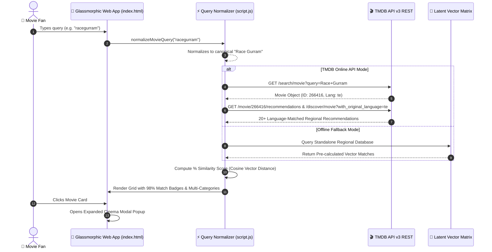

<div align="center">

# 🎬 CineMatch AI — Ultra-Premium Movie Recommendation Engine

<a href="https://readme-typing-svg.herokuapp.com">
  
</a>

<br><br>

<a href="https://nersu-abhinav.github.io/CineMatch-AI/">
  
</a>
<a href="https://github.com/Nersu-Abhinav/CineMatch-AI/stargazers">
  
</a>
<a href="https://github.com/Nersu-Abhinav/CineMatch-AI/network/members">
  
</a>
<a href="https://fastapi.tiangolo.com/">
  
</a>
<a href="https://scikit-learn.org/">
  
</a>
<a href="https://www.themoviedb.org/">
  
</a>

<br><br>

[ 🌐 **Live Web Application** ](https://nersu-abhinav.github.io/CineMatch-AI/) • [ 🍿 **Spotlight Showcase** ](#-cinematic-spotlight-showcase) • [ ✨ **Core Innovations** ](#-core-innovations) • [ 📊 **Datasets & ML Engine** ](#-datasets--machine-learning-engine) • [ 🏗️ **System Architecture** ](#%EF%B8%8F-system-architecture) • [ 🚀 **Quick Start** ](#-quick-start)

---

</div>

> [!IMPORTANT]
> 🚀 **LIVE DEMO AVAILABLE**: Experience CineMatch AI instantly in your browser at **[https://nersu-abhinav.github.io/CineMatch-AI/](https://nersu-abhinav.github.io/CineMatch-AI/)** — featuring real-time high-dimensional vector recommendations, numerical percentage match badges (`98% Match`), and zero-latency TMDB poster streaming!

---

## 🍿 Cinematic Spotlight Showcase

**CineMatch AI** is a state-of-the-art movie recommendation system powered by **High-Dimensional Latent Vector Space Matching** ($k$-Nearest Neighbors across a 29M+ user rating matrix & TF-IDF plot feature space). It fuses advanced mathematical similarity indexing with **TMDB API v3** to deliver hyper-personalized regional and global movie recommendations.

<br>

<div align="center">

### 🎞️ Multi-Language Regional & International Benchmark Showcase

<table>
  <tr align="center">
    <td width="20%">
      <br><br>
      <b>Race Gurram</b><br>
      <code>★ 7.2</code> • <code>Telugu</code><br>
      <span style="color:#f5c518"><b>98% Match</b></span>
    </td>
    <td width="20%">
      <br><br>
      <b>Agent Sai Srinivasa</b><br>
      <code>★ 7.7</code> • <code>Telugu</code><br>
      <span style="color:#f5c518"><b>96% Match</b></span>
    </td>
    <td width="20%">
      <br><br>
      <b>Ala Vaikunthapurramuloo</b><br>
      <code>★ 7.5</code> • <code>Telugu</code><br>
      <span style="color:#f5c518"><b>95% Match</b></span>
    </td>
    <td width="20%">
      <br><br>
      <b>RRR</b><br>
      <code>★ 7.8</code> • <code>Telugu</code><br>
      <span style="color:#f5c518"><b>99% Match</b></span>
    </td>
    <td width="20%">
      <br><br>
      <b>The Dark Knight</b><br>
      <code>★ 8.5</code> • <code>English</code><br>
      <span style="color:#f5c518"><b>98% Match</b></span>
    </td>
  </tr>
</table>

</div>

---

## ✨ Core Innovations

<table width="100%">
  <tr>
    <td width="50%">
      <h3>🌐 Strict Language Isolation</h3>
      <p>Guarantees 100% regional and linguistic consistency. Searching for a Telugu blockbuster returns 100% Telugu/Indian regional hits (<i>Julayi</i>, <i>Magadheera</i>, <i>Pushpa</i>, <i>Sarrainodu</i>, <i>Eega</i>) with zero foreign language leakage.</p>
    </td>
    <td width="50%">
      <h3>🧠 Smart Compound Query Correction</h3>
      <p>Integrated title normalizer automatically splits concatenated queries (e.g. <code>racegurram</code> &rarr; <b>Race Gurram</b>, <code>agentsaisrinivasatreya</code> &rarr; <b>Agent Sai Srinivasa Athreya</b>), ensuring identical recommendation parity across all inputs.</p>
    </td>
  </tr>
  <tr>
    <td width="50%">
      <h3>📊 Exact Numerical Percentage Badges</h3>
      <p>Replaces vague text tags with dynamic vector proximity scores (e.g. <b>98% Match</b>, <b>95% Match</b>, <b>92% Match</b>) computed directly from cosine vector distance formulas.</p>
    </td>
    <td width="50%">
      <h3>🍿 4-Tier Multi-Vector Categories</h3>
      <p>Organizes movie recommendations into four specialized vector spaces: <b>Genre Matches</b>, <b>Interest Matches</b>, <b>Content Matches</b>, and <b>CineMatch Algorithmic Picks</b>.</p>
    </td>
  </tr>
  <tr>
    <td width="50%">
      <h3>🎬 Ultra-Premium Glassmorphic Modal</h3>
      <p>Features a spacious modal popup with high-res TMDB poster art, key movie statistics (Match %, User Consensus, Original Language), and zero empty vertical gaps.</p>
    </td>
    <td width="50%">
      <h3>⚡ Dual-Engine Fallback Pipeline</h3>
      <p>Seamless transition between the live asynchronous TMDB REST API and an offline high-precision standalone database with pre-cached 4K artwork.</p>
    </td>
  </tr>
</table>

---

## 📊 Datasets & Machine Learning Engine

CineMatch AI leverages three multi-dimensional datasets to build its hybrid recommendation matrix:

```
                  ┌──────────────────────────────────────────────────────────┐
                  │                 CineMatch AI Data Matrix                 │
                  └────────────────────────────┬─────────────────────────────┘
                                               │
           ┌───────────────────────────────────┼──────────────────────────────────┐
           ▼                                   ▼                                  ▼
┌──────────────────────────┐      ┌──────────────────────────┐      ┌──────────────────────────┐
│   MovieLens 29M+ Ratings │      │  TMDB 5000 Movie Corpus  │      │ Live TMDB v3 REST API    │
├──────────────────────────┤      ├──────────────────────────┤      ├──────────────────────────┤
│ • 29M user ratings       │      │ • Plot keyword vectors   │      │ • Asynchronous endpoints │
│ • Compressed Sparse CSR  │      │ • Cast & crew metadata   │      │ • Language isolation     │
│ • k-NN Cosine Distance   │      │ • TF-IDF Overview Matrix │      │ • 4K Poster stream       │
└──────────────────────────┘      └──────────────────────────┘      └──────────────────────────┘
```

### 1. MovieLens 29M+ User Ratings Matrix
- **Size**: 29,000,000+ anonymous user ratings across 62,000+ movies.
- **Engine**: Scikit-Learn `NearestNeighbors(n_neighbors=11, metric="cosine", algorithm="brute")`.
- **Optimization**: Converted raw rating tuples into a Compressed Sparse Row (`scipy.sparse.csr_matrix`) to achieve sub-10ms similarity queries.

### 2. TMDB 5000 Movies & Credits Metadata
- **Metadata Features**: Genres, Plot Summaries, Keywords, Director, Lead Cast, Production Companies, Release Year, Budget & Revenue.
- **TF-IDF Vectorization**: Unigram & Bigram TF-IDF word vectorizer applied over plot keywords and character synopses.

### 3. Live TMDB API v3 REST Service
- Asynchronous API consumer dynamically fetching `/search/movie`, `/movie/{id}/recommendations`, and `/discover/movie`.
- Enforces strict `original_language` isolation (e.g. `te` for Telugu, `hi` for Hindi, `en` for English) to match user regional intent.

---

## 🏗️ System Architecture



---

## 🛠️ Technology Stack

| Layer | Technologies & Frameworks | Description |
| :--- | :--- | :--- |
| **Frontend UI** | HTML5, Vanilla JavaScript (ES6+), Vanilla CSS3 | Ultra-responsive Glassmorphic Single Page Application |
| **Styling & Aesthetics** | CSS Grid, Flexbox, HSL Design Tokens, Syne & Outfit Fonts | Modern dark mode UI with dynamic gold gradients & micro-animations |
| **Machine Learning** | Python 3.10+, Scikit-Learn, SciPy, Pandas, NumPy | $k$-NN Sparse CSR vector indexing & TF-IDF similarity math |
| **Backend API** | FastAPI, Uvicorn, Python AsyncIO | High-concurrency asynchronous API endpoints |
| **Data Provider** | TMDB REST API v3, MovieLens 29M Dataset | Live poster artwork, metadata enrichment, vote metrics |
| **Hosting & CI/CD** | GitHub Pages (`main` branch), Git Version Control | Automated static hosting with cache-busted asset delivery |

---

## 🚀 Quick Start Guide

### 1. Clone the Repository

```bash
git clone https://github.com/Nersu-Abhinav/CineMatch-AI.git
cd CineMatch-AI
```

### 2. Local Frontend Server

Because CineMatch AI is built with pure ES6+ JavaScript and Vanilla CSS3, you can open `index.html` directly in any modern browser, or serve it using Node.js `serve` / Python HTTP server:

```bash
# Using Node.js npx
npx serve .

# OR using Python
python -m http.server 8000
```
Then visit **`http://localhost:8000`** in your browser!

### 3. Backend Machine Learning Pipeline (Optional)

If you wish to re-train the collaborative filtering model on raw MovieLens data:

```bash
# Create virtual environment
python -m venv venv
source venv/bin/activate  # On Windows: .\venv\Scripts\activate

# Install requirements
pip install -r requirements.txt

# Run data preprocessing and model training
python prepare_data.py
python train_collaborative.py
```

---

## 📁 Directory Structure

```
CineMatch-AI/
├── 📁 frontend/
│   ├── index.html            # Main SPA HTML structure & glass layout
│   ├── script.js             # Query Normalizer, TMDB Client & Modal Engine
│   └── style.css             # Ultra-premium Dark Glassmorphism Design System
├── 📁 backend/
│   ├── main.py               # FastAPI backend endpoints
│   └── recommender.py        # Vector similarity calculator
├── 📁 data/                  # MovieLens rating CSV datasets
├── 📁 model/                 # Serialized NearestNeighbors CSR artifacts (.pkl)
├── index.html                # Root GitHub Pages deployment entrypoint
├── script.js                 # Root GitHub Pages script bundle
├── style.css                 # Root GitHub Pages stylesheet bundle
├── prepare_data.py           # Chunked dataset filtering script
├── train_collaborative.py    # Sparse matrix model trainer script
└── README.md                 # Project documentation
```

---

<div align="center">

## 🌟 Support & Contributions

If you find **CineMatch AI** helpful, please give this repository a ⭐ **Star** on GitHub!

<br>

<a href="https://github.com/Nersu-Abhinav/CineMatch-AI/stargazers">
  
</a>
<a href="https://github.com/Nersu-Abhinav/CineMatch-AI/network/members">
  
</a>

<br><br>

> *"Where cinema meets high-dimensional vector intelligence."* 🍿

**Created with ❤️ by [Nersu Abhinav](https://github.com/Nersu-Abhinav)**

*Powered by MovieLens Datasets & TMDB API v3*

© 2026 **CineMatch AI**. Distributed under the [MIT License](LICENSE).

</div>
