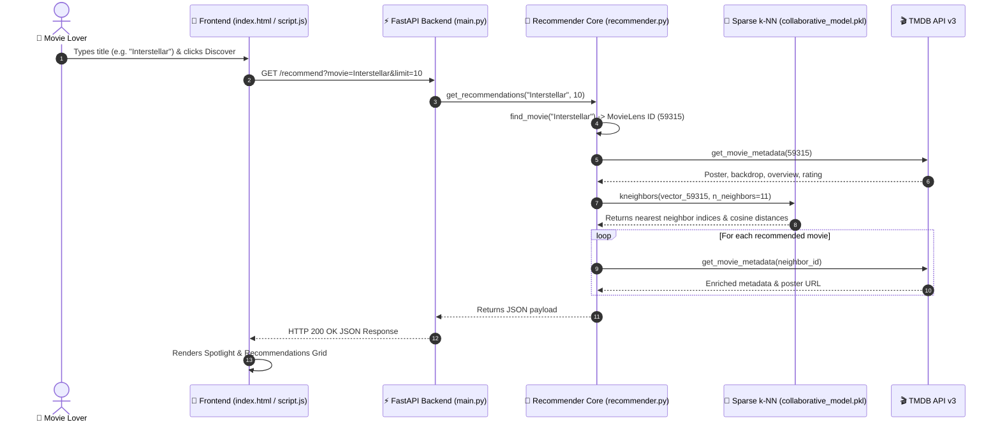

<div align="center">

# 🎬 CineMatch AI — Next-Gen Movie Recommendation Engine

> **High-Dimensional Item-Item Collaborative Filtering & Real-Time TMDB Metadata Enrichment**

[](https://nersu-abhinav.github.io/CineMatch-AI/)
[](https://www.python.org/)
[](https://fastapi.tiangolo.com/)
[](https://scikit-learn.org/)
[](https://www.themoviedb.org/)
[](LICENSE)

[🌐 Live Demo](https://nersu-abhinav.github.io/CineMatch-AI/) • [✨ Features](#-key-features) • [🏗️ Architecture](#%EF%B8%8F-architecture--data-pipeline) • [🛠️ Tech Stack](#%EF%B8%8F-tech-stack) • [🚀 Quick Start](#-quick-start)

---

</div>

> [!NOTE]
> **Experience CineMatch AI Online**: Access the deployed single-page discovery web app instantly at **[https://nersu-abhinav.github.io/CineMatch-AI/](https://nersu-abhinav.github.io/CineMatch-AI/)**. No installation required!

---

## 🌟 Overview

**CineMatch AI** is a state-of-the-art movie discovery platform engineered with **Item-Item Collaborative Filtering** ($k$-Nearest Neighbors over a 29+ million user rating matrix). It seamlessly fuses machine learning recommendation vectors with **TMDB API v3** real-time metadata enrichment to deliver hyper-personalized movie recommendations instantly.

---

## ✨ Key Features

| Feature | Description |
| :--- | :--- |
| ⚡ **Vector Space Similarity** | High-performance $k$-NN Cosine Distance computations via `scikit-learn` `NearestNeighbors(metric="cosine")`. |
| 📊 **Sparse CSR Pipeline** | Memory-optimized chunked processing of 29M+ ratings into SciPy Sparse CSR matrices without memory overflow. |
| 🖼️ **Real-Time TMDB Posters** | Dynamic live fetching of 4K backdrops, high-res posters, vote metrics, genres, and synopses. |
| 🎨 **Glassmorphic UI** | Responsive dark-mode interface built with modern CSS custom tokens, glass overlays, and smooth animations. |
| 🔍 **Discovery Controls** | In-memory dynamic sorting (Similarity, Rating, Release Year, Title) and real-time genre/rating filters. |
| ⚡ **Chain Discovery** | Interactive 1-click discovery chain: click any movie card to instantly spawn recommendations for that film. |
| 🚀 **1-Click Automation** | Included Windows PowerShell launcher script (`start_project.ps1`) to run API & UI servers concurrently. |

---

## 🏗️ Architecture & Data Pipeline



---

## 🛠️ Tech Stack

```
   ┌─────────────────────────────────────────────────────────────┐
   │                        CINEMATCH AI                         │
   └──────────────┬───────────────────────────────┬──────────────┘
                  │                               │
       ┌──────────┴───────────┐       ┌───────────┴──────────┐
       │   BACKEND ENGINE     │       │   FRONTEND ENGINE    │
       ├──────────────────────┤       ├──────────────────────┤
       │  • Python 3.10+      │       │  • HTML5 Semantic    │
       │  • FastAPI           │       │  • Vanilla JS (ES6+) │
       │  • Uvicorn           │       │  • Glassmorphic CSS  │
       │  • Scikit-Learn k-NN │       │  • Google Outfit Font│
       │  • SciPy Sparse CSR  │       │  • Responsive Grid   │
       │  • Pandas / NumPy    │       └──────────────────────┘
       │  • TMDB API v3 Client│
       └──────────────────────┘
```

---

## 🚀 Quick Start

### 1. Prerequisites
- **Python 3.10** or higher installed
- Free TMDB API Key / Access Token ([Get key from TMDB](https://www.themoviedb.org/settings/api))

### 2. Installation & Environment Setup

```bash
# 1. Clone the repository
git clone https://github.com/Nersu-Abhinav/CineMatch-AI.git
cd CineMatch-AI

# 2. Create virtual environment
python -m venv venv

# On Windows:
.\venv\Scripts\activate
# On macOS/Linux:
source venv/bin/activate

# 3. Install core dependencies
pip install fastapi uvicorn pandas numpy scipy scikit-learn joblib requests python-dotenv
```

### 3. Configure Environment Variables
Copy `.env.example` to `.env` and insert your TMDB Read Access Token:

```bash
cp .env.example .env
```

Edit `.env`:
```env
TMDB_API_TOKEN=your_tmdb_read_access_token_here
```

### 4. Prepare Data & Train Model

```bash
# Step 1: Filter raw ratings down to top 5,000 catalog items
python prepare_data.py

# Step 2: Train Item-Item Nearest-Neighbors collaborative model
python train_collaborative.py
```

### 5. Launch Application

> [!TIP]
> **Windows PowerShell Users**: Run the included 1-click launcher script to spin up both backend and frontend servers simultaneously!
> ```powershell
> .\start_project.ps1
> ```

**Manual Launch**:

- **Terminal 1 (FastAPI Backend)**:
  ```bash
  python -m uvicorn backend.main:app --reload --port 8000
  ```
- **Terminal 2 (Frontend Local Server)**:
  ```bash
  cd frontend
  python -m http.server 5500
  ```
- Open browser at: **`http://127.0.0.1:5500`**

---

## 📁 Repository Structure

```
CineMatch-AI/
├── 📁 backend/
│   ├── main.py                # FastAPI app routes, CORS, /recommend endpoint
│   └── recommender.py         # 3-tier recommendation cascade engine
├── 📁 data/                      # MovieLens links & dataset files
├── 📁 frontend/
│   ├── index.html             # Application markup & glassmorphic layout
│   ├── script.js              # State management & dynamic TMDB fallback pipeline
│   └── style.css              # Dark-mode design system & visual tokens
├── 📁 model/                     # Serialized k-NN model artifacts (.pkl)
├── movie_metadata.py          # MovieLens ID to TMDB API bridge
├── prepare_data.py            # Chunked data filtering pipeline
├── recommend_collaborative.py # CLI recommendation test script
├── start_project.ps1          # 1-click Windows PowerShell launcher
├── tmdb.py                    # TMDB API v3 client wrapper
├── train_collaborative.py     # NearestNeighbors sparse model trainer
├── .env.example               # Environment variables template
└── README.md                  # Project documentation & reference
```

---

<div align="center">

## 🌟 Support & Feedback

If you enjoy using **CineMatch AI**, please consider giving this repository a ⭐ **Star** on GitHub!

[](https://github.com/Nersu-Abhinav/CineMatch-AI/stargazers)
[](https://github.com/Nersu-Abhinav/CineMatch-AI/network/members)

<br>

<a href="#top">
  
</a>

<br><br>

**Crafted with ❤️ for movie lovers worldwide.**

*Powered by MovieLens Datasets & TMDB API v3*

© 2026 **CineMatch AI**. Distributed under the [MIT License](LICENSE).

---

</div>
