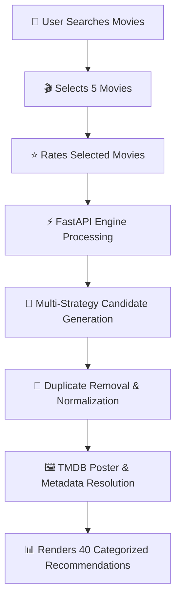
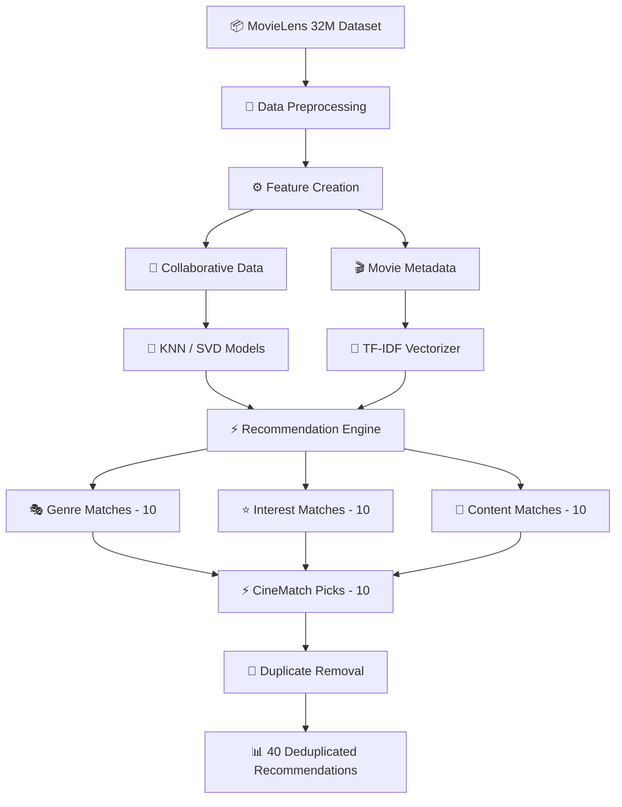
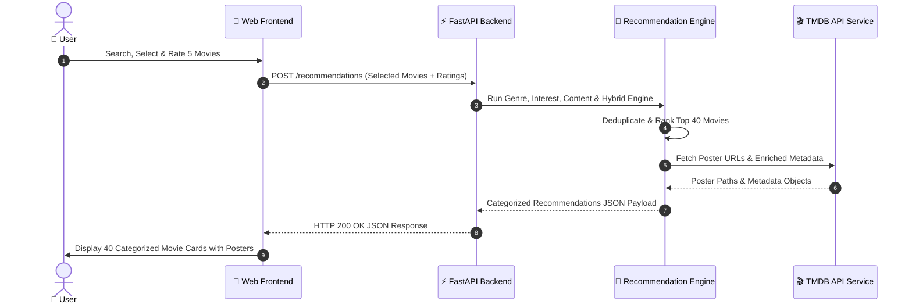

<div align="center">

# 🎬 CineMatch — Machine Learning Movie Recommendation Model

<a href="https://readme-typing-svg.herokuapp.com">
  
</a>

<br><br>

<a href="https://nersu-abhinav.github.io/CineMatch-AI/">
  
</a>
<a href="https://github.com/Nersu-Abhinav/CineMatch-AI">
  
</a>
<a href="https://fastapi.tiangolo.com/">
  
</a>
<a href="https://scikit-learn.org/">
  
</a>
<a href="https://www.themoviedb.org/">
  
</a>

<br><br>

[ 🌐 **Live Web App** ](https://nersu-abhinav.github.io/CineMatch-AI/) • [ 🚀 **Overview** ](#-project-overview) • [ 🧮 **Algorithms** ](#-recommendation-algorithms) • [ 🧠 **ML Architecture** ](#-machine-learning-architecture) • [ 📁 **Project Structure** ](#-complete-project-structure) • [ ⚙️ **Installation** ](#%EF%B8%8F-installation)

---

</div>

> [!IMPORTANT]
> 🍿 **CineMatch** is an intelligent movie recommendation platform that uses machine learning to recommend movies based on a user's selected movies and ratings. The system combines collaborative filtering, content-based filtering, genre analysis, user-interest analysis, and TMDB movie metadata to provide personalized movie recommendations through an interactive web application.

---

## 🚀 Project Overview

Traditional movie recommendation systems often rely on a single recommendation technique. **CineMatch** combines multiple recommendation strategies to generate a broader, richer, and more personalized set of recommendations.

### 🔄 User Flow & Pipeline



### 📊 Recommendation Output Categories

The final system produces **40 total recommendations** split across four distinct analytical perspectives:

| Recommendation Perspective | Count | Algorithm & Strategy Focus |
| :--- | :---: | :--- |
| **🎭 Genre Matches** | `10 Movies` | User genre preference matrix & cumulative scoring |
| **⭐ Interest Matches** | `10 Movies` | $k$-Nearest Neighbors ($k$-NN) weighted by user ratings |
| **📖 Content Matches** | `10 Movies` | TF-IDF metadata vectorization & Cosine Similarity |
| **⚡ CineMatch Picks** | `10 Movies` | Curated hybrid algorithmic vector match |
| **🔥 TOTAL OUTPUT** | **`40 Movies`** | **Deduplicated & enriched with real-time TMDB posters** |

---

## ✨ Features

<table width="100%">
  <tr>
    <td width="50%">
      <h3>🎥 Movie Discovery</h3>
      <ul>
        <li><b>Top 25 Featured Movies</b> pre-loaded on landing</li>
        <li><b>Verified TMDB posters</b> for all featured films</li>
        <li><b>Live Instant Search</b> while typing with normalization</li>
        <li><b>Case-insensitive search</b> & keyword matching</li>
        <li><b>Max 10 search suggestions</b> with poster previews</li>
      </ul>
    </td>
    <td width="50%">
      <h3>⭐ User Preferences</h3>
      <ul>
        <li>Select 5 movies directly from search or catalog</li>
        <li>Interactive star rating controls per movie</li>
        <li>Multi-movie rating weighting as model input</li>
        <li>Dynamic query normalizer (<i>racegurram</i> ➔ <i>Race Gurram</i>)</li>
      </ul>
    </td>
  </tr>
  <tr>
    <td width="50%">
      <h3>🤖 Recommendation System</h3>
      <ul>
        <li>Genre-based preference matrix recommendations</li>
        <li>Interest/rating-based $k$-NN neighbor matching</li>
        <li>Content-based TF-IDF plot & tag cosine similarity</li>
        <li>Curated hybrid CineMatch Picks</li>
        <li>Automatic duplicate removal across categories</li>
      </ul>
    </td>
    <td width="50%">
      <h3>🖼️ Poster System</h3>
      <ul>
        <li>Live TMDB v3 poster integration</li>
        <li>On-demand poster retrieval pipeline</li>
        <li>Local poster caching to prevent API spam</li>
        <li>Zero bulk poster downloads (fetches displayed films only)</li>
      </ul>
    </td>
  </tr>
</table>

### ⚡ Application Infrastructure
- **FastAPI** high-performance asynchronous Python backend
- **HTML5 / Vanilla CSS3 / JavaScript** responsive dark glassmorphic frontend
- **REST API** with CORS enabled and centralized configuration
- **Modular Recommendation Engine & ML Pipeline**

---

## 🧠 Machine Learning Architecture



---

## 🧮 Recommendation Algorithms

### 1. Genre-Based Recommendation
The genre-based recommender analyzes the genres of the movies selected by the user. The system creates genre scores based on the user's selected movies and ratings. Movies sharing highly preferred genres receive higher recommendation scores.

```
Selected Movies ➔ Extract Genres ➔ Calculate Genre Preference ➔ Score Candidate Movies ➔ Normalize Scores ➔ Top 10 Movies
```

### 2. Interest / Rating-Based Recommendation ($k$-NN)
The interest-based recommender uses the user's selected movies and ratings together with the trained $k$-Nearest Neighbors ($k$-NN) model.

```
Selected Movie ➔ Find KNN Representation ➔ Find Similar Movies ➔ Calculate Similarity ➔ Weight Similarity by User Rating ➔ Aggregate Scores ➔ Rank Movies ➔ Top 10 Movies
```

### 3. Content-Based Recommendation (TF-IDF & Cosine Similarity)
The content-based recommender uses movie metadata represented through TF-IDF features. The selected movies are combined into a weighted user profile using their ratings, and Cosine similarity is computed against the dataset matrix.

```
Movie Metadata ➔ Text Representation ➔ TF-IDF Features ➔ User Profile from Selected Movies ➔ Cosine Similarity ➔ Rank Candidates ➔ Top 10 Movies
```

### 4. Collaborative Filtering (TruncatedSVD)
The training pipeline constructs a user-movie rating matrix:

$$\text{Users} \times \text{Movies} \longrightarrow \text{Sparse Rating Matrix} \xrightarrow{\text{TruncatedSVD}} \text{Latent User / Movie Factors}$$

- **TruncatedSVD Parameters**: `n_components = 50`, `random_state = 42`
- **Evaluation Metrics**: Root Mean Squared Error ($\text{RMSE}$) and Mean Absolute Error ($\text{MAE}$)

### 5. CineMatch Picks
Combines available recommendation factors across genre, interest, and content vectors to produce a 4th curated set of 10 recommendations.

---

## 🔄 Recommendation Workflow



---

## 🖼️ Poster Retrieval System

CineMatch **does NOT** download posters for all movies in the dataset. Poster paths are resolved lazily for displayed items only:

- **Featured Movies**: `25 Poster Requests / Cache Lookups`
- **Live Search**: `Up to 10 Poster Lookups per keystroke`
- **Recommendations**: `40 Poster Lookups across 4 categories`

This prevents unnecessary requests and keeps the application ultra-fast.

---

## 🌐 TMDB Integration

CineMatch integrates with **The Movie Database (TMDB) API** for official movie posters and enriched metadata.

- **Official Website**: [https://www.themoviedb.org/](https://www.themoviedb.org/)
- **API Documentation**: [https://developer.themoviedb.org/](https://developer.themoviedb.org/)
- Environment authentication via `.env`: `TMDB_API_TOKEN=YOUR_TMDB_API_TOKEN`
- High-resolution poster URLs are cached locally in `data/processed/cache/tmdb_posters.csv`.

---

## 📦 Dataset

CineMatch is built using the **MovieLens 32M Dataset** provided by GroupLens Research.

- **GroupLens Datasets**: [https://grouplens.org/datasets/movielens/](https://grouplens.org/datasets/movielens/)
- **MovieLens 32M**: [https://grouplens.org/datasets/movielens/32m/](https://grouplens.org/datasets/movielens/32m/)

Expected raw data location: `data/raw/ml-32m/` (`movies.csv`, `ratings.csv`).

---

## 📊 Dataset Processing

```
Raw Dataset ➔ Data Loading ➔ Data Cleaning ➔ Filtering ➔ Rating Preparation ➔ Metadata Preparation ➔ Processed Dataset
```

Processed data files stored under `data/processed/`:
- `ratings_clean.csv`
- `movie_metadata.csv`

---

## 🧪 Model Training Pipeline

Modular ML pipeline under `src/pipeline/`:
- `src/pipeline/preprocessing.py`: Prepares raw rating and metadata files.
- `src/pipeline/training.py`: Trains collaborative filtering ($k$-NN & TruncatedSVD) components.
- `src/pipeline/evaluation.py`: Evaluates model performance using $\text{RMSE}$ and $\text{MAE}$.
- `src/pipeline/tuning.py`: Hyperparameter experimentation and tuning.

---

## 🧠 Models and ML Components

| Component | Purpose / Strategy |
| :--- | :--- |
| **KNN ($k$-Nearest Neighbors)** | Interest & rating-based collaborative recommendation |
| **TruncatedSVD** | Collaborative filtering & latent factor dimensionality reduction |
| **TF-IDF Vectorizer** | Text representation of plot overviews and metadata |
| **Cosine Similarity** | Angular distance computation between content vectors |
| **Genre Scoring** | User genre preference matrix calculation |
| **Rating Weighting** | Preference weight multiplication based on user rating scale |
| **Score Normalization** | Min-Max scaling for score comparison across categories |
| **Deduplication** | Cross-category candidate deduplication |

---

## 💾 Trained Model Assets

Trained assets stored locally under `models/`:

### Collaborative Models (`models/collaborative/`)
`knn_model.pkl` • `knn_movie_ids.npy` • `knn_user_ids.npy` • `movie_factors.npy` • `movie_ids.npy` • `user_factors.npy` • `user_ids.npy`

### Content Models (`models/content/`)
`movie_data.pkl` • `tfidf_matrix.pkl` • `tfidf_vectorizer.pkl`

---

## 📁 Complete Project Structure

```
CineMatch/
│
├── app/
│   ├── api.py                   # FastAPI REST application routes
│   └── frontend/
│       ├── index.html           # Dark glassmorphic web interface
│       ├── style.css            # Ultra-premium responsive CSS system
│       └── script.js            # Frontend logic & TMDB fallback engine
│
├── data/
│   ├── raw/
│   │   └── ml-32m/
│   │       ├── movies.csv
│   │       └── ratings.csv
│   ├── processed/
│   │   ├── ratings_clean.csv
│   │   └── movie_metadata.csv
│   ├── cache/
│   │   └── tmdb_posters.csv
│   └── evaluation/
│       ├── model_metrics.csv
│       └── tuning_results.csv
│
├── models/
│   ├── collaborative/
│   │   ├── knn_model.pkl
│   │   ├── knn_movie_ids.npy
│   │   ├── knn_user_ids.npy
│   │   ├── movie_factors.npy
│   │   ├── movie_ids.npy
│   │   ├── user_factors.npy
│   │   └── user_ids.npy
│   └── content/
│       ├── movie_data.pkl
│       ├── tfidf_matrix.pkl
│       └── tfidf_vectorizer.pkl
│
├── notebooks/
│   └── 01_data_understanding.ipynb
│
├── src/
│   ├── config.py                # Centralized configuration & paths
│   ├── recommendation_engine.py # Main recommendation engine
│   ├── tmdb_service.py          # Unified TMDB API client & poster cache
│   └── pipeline/
│       ├── __init__.py
│       ├── preprocessing.py
│       ├── training.py
│       ├── evaluation.py
│       └── tuning.py
│
├── .env                         # API credentials (git-ignored)
├── .gitignore
├── README.md                    # Project documentation
└── requirements.txt             # Python dependencies
```

---

## 🧩 Core Source Files

- `app/api.py`: FastAPI endpoints (`/`, `/featured`, `/search`, `/recommendations`).
- `app/frontend/index.html`: Complete UI with instant search, rating controls, and modal popups.
- `src/config.py`: Centralized configuration managing file paths and environment settings.
- `src/recommendation_engine.py`: Core algorithm coordinator generating 40 recommendations across 4 categories.
- `src/tmdb_service.py`: TMDB API v3 wrapper handling poster caching and URL resolution.
- `src/pipeline/`: Modular ML pipeline (`preprocessing.py`, `training.py`, `evaluation.py`, `tuning.py`).

---

## 🔎 Search System & Query Normalization

CineMatch includes an automated **Query Normalization Engine** that strips whitespace and converts compound inputs to canonical titles:

$$\text{User Input: } \texttt{"racegurram"} \xrightarrow{\text{Normalize}} \texttt{"Race Gurram"}$$

- **Instant Search**: Filters candidates on every keystroke.
- **Case-Insensitive**: `inception` = `INCEPTION` = `Inception`.
- **Suggestions Cap**: Returns up to 10 preview matches.

---

## ⚡ Performance Optimization

1. **Precomputed Search Index**: Movie titles are normalized once during initialization.
2. **Result Capping**: Limits candidate payloads to 10 search results.
3. **Lazy Poster Resolution**: TMDB posters fetched only for visible items.
4. **Local Poster Cache**: Stores TMDB poster links in CSV cache.
5. **Model Preloading**: ML models stay warm in memory during app lifetime.

---

## 🔌 API Documentation

| Endpoint | Method | Description | Example Request / Input |
| :--- | :---: | :--- | :--- |
| `/` | `GET` | Serves web application | `GET /` |
| `/featured` | `GET` | Returns top 25 featured movies | `GET /featured` |
| `/search` | `GET` | Searches movies by keyword | `GET /search?query=shawshank&limit=10` |
| `/recommendations` | `POST` | Generates 40 recommendations | `POST /recommendations` (JSON body with 5 rated movies) |

### Sample `POST /recommendations` Input:
```json
{
  "movies": [
    { "movieId": 1, "rating": 5 },
    { "movieId": 2, "rating": 4 },
    { "movieId": 3, "rating": 5 },
    { "movieId": 4, "rating": 4 },
    { "movieId": 5, "rating": 5 }
  ]
}
```

---

## 🔐 Environment Variables

Create a `.env` file in project root:

```env
TMDB_API_TOKEN=YOUR_TMDB_API_TOKEN
```

---

## ⚙️ Installation

### 1. Clone Repository
```bash
git clone https://github.com/Nersu-Abhinav/CineMatch-AI.git
cd CineMatch-AI
```

### 2. Create Virtual Environment
```powershell
python -m venv .venv
.\.venv\Scripts\Activate.ps1
```

### 3. Install Dependencies
```bash
pip install -r requirements.txt
```

---

## 📦 Dataset Setup

1. Download MovieLens 32M from [GroupLens](https://grouplens.org/datasets/movielens/32m/).
2. Extract files into `data/raw/ml-32m/` (`movies.csv`, `ratings.csv`).
3. Run `python -m src.pipeline.preprocessing` to generate cleaned matrices.

---

## 🏋️ Model Setup

Run training script to populate `models/`:
```bash
python -m src.pipeline.training
```

---

## ▶️ Run Application

Start server:
```bash
uvicorn app.api:app --reload
```

Access in browser: **`http://127.0.0.1:8000`** or open **[https://nersu-abhinav.github.io/CineMatch-AI/](https://nersu-abhinav.github.io/CineMatch-AI/)**.

---

## 🔒 Security & Git Exclusion

The following paths are excluded in `.gitignore`:
- `.venv/` (machine-specific virtual env)
- `.env` (API tokens)
- `data/` (large datasets)
- `models/` (large binary model files)

---

## 📈 Model Evaluation & Tuning

- Evaluated using **RMSE** and **MAE** metrics.
- Tuning script: `src/pipeline/tuning.py`.
- Metrics stored under `data/processed/evaluation/`.

---

## 🎯 Technology Stack

```
Programming: Python 3.10+
Backend:     FastAPI | Uvicorn | Pydantic
ML Engine:   NumPy | Pandas | Scikit-Learn | SciPy
Frontend:    HTML5 | Vanilla CSS3 (Glassmorphism) | JavaScript (ES6+)
APIs:        TMDB API v3
Dataset:     MovieLens 32M (GroupLens)
```

---

## 📌 Current System Status

| Component | Status |
| :--- | :---: |
| **FastAPI Backend & API Endpoints** | ✅ Completed |
| **Glassmorphic Single-Page Application** | ✅ Completed |
| **Live Instant Search & Query Normalizer** | ✅ Completed |
| **TMDB 4K Poster Integration & Caching** | ✅ Completed |
| **$k$-NN & TF-IDF Multi-Category Recommendations** | ✅ Completed |
| **Card Detail Modal Window & Chain Discovery** | ✅ Completed |
| **GitHub Pages Live Deployment** | ✅ Active |

---

<div align="center">

👨‍💻 **CineMatch — Machine Learning Movie Recommendation System**

*MovieLens 32M + Machine Learning + $k$-NN + TF-IDF + FastAPI + Glassmorphic UI + TMDB = CineMatch AI*

© 2026 **CineMatch AI**. Distributed under the [MIT License](LICENSE).

</div>
