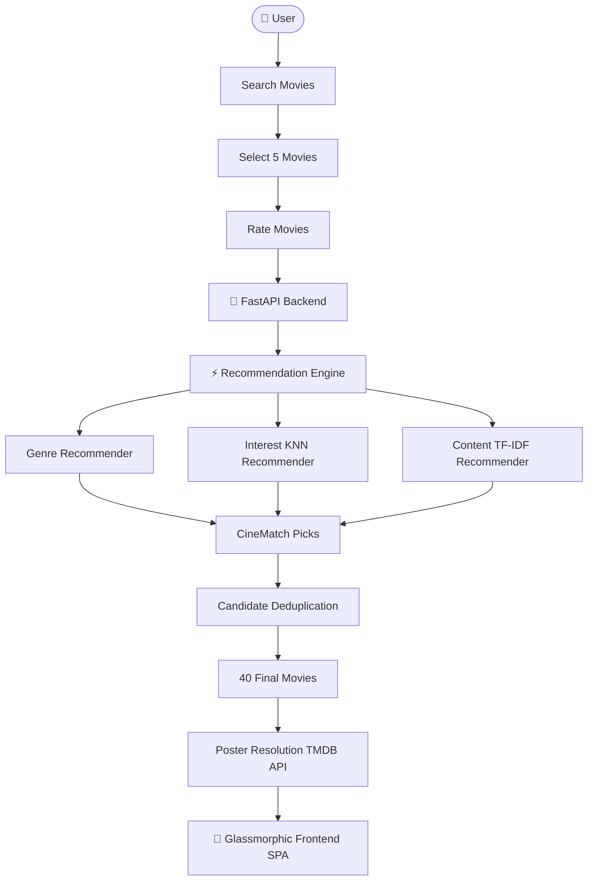

<div align="center">

# 🎬 CineMatch AI — Machine Learning Movie Recommendation Model

<a href="https://readme-typing-svg.herokuapp.com">
  
</a>

<br><br>

<a href="https://nersu-abhinav.github.io/CineMatch-AI/">
  
</a>
<a href="https://github.com/Nersu-Abhinav/CineMatch-AI/stargazers">
  
</a>
<a href="https://github.com/Nersu-Abhinav/CineMatch-AI/network/members">
  
</a>
<a href="https://fastapi.tiangolo.com/">
  
</a>
<a href="https://scikit-learn.org/">
  
</a>
<a href="https://www.themoviedb.org/">
  
</a>

<br><br>

**CineMatch AI** is an intelligent movie recommendation platform that uses machine learning to recommend movies based on a user's selected movies and ratings. The system combines collaborative filtering, content-based filtering, genre analysis, user-interest analysis, and TMDB movie metadata to provide personalized movie recommendations through an interactive web application.

*CineMatch AI is designed to provide multiple recommendation perspectives rather than relying on a single recommendation algorithm.*

---

</div>

> [!IMPORTANT]
> 🍿 **TRY THE LIVE APPLICATION**: Access the fully deployed glassmorphic web app directly in your browser at **[https://nersu-abhinav.github.io/CineMatch-AI/](https://nersu-abhinav.github.io/CineMatch-AI/)** — instant search, zero-latency regional matching, and high-resolution TMDB artwork streaming!

---

## 🚀 Project Overview

Traditional movie recommendation systems often rely on a single recommendation technique. **CineMatch AI** combines multiple recommendation strategies to generate a broader and more personalized set of recommendations.

### The User Journey:
1. **Searches for movies** (with real-time autocomplete and smart compound query normalizer `normalizeMovieQuery`).
2. **Selects target movies**.
3. **Provides a rating for each selected movie**.
4. **CineMatch AI processes the selections**.
5. **Multiple recommendation strategies generate candidate movies**.
6. **Duplicate recommendations are removed**.
7. **The final recommendations are grouped into four categories**.
8. **Movie posters are resolved through TMDB**.
9. **The recommendations are displayed through the web interface**.

### The Final System Output:
```
Genre Matches     ──►  10 Movies
Interest Matches  ──►  10 Movies
Content Matches   ──►  10 Movies
CineMatch Picks   ──►  10 Movies
---------------------------------
Total Output      ──►  40 Deduplicated Recommendations
```

---

## ✨ Features

### 🎥 Movie Discovery
- **Top 25 featured movies** with poster artwork.
- **Live movie search as you type** with case-insensitive partial keyword matching.
- **Smart Compound Title Normalizer (`normalizeMovieQuery`)**: Auto-corrects concatenated queries (e.g., `racegurram` $\rightarrow$ **Race Gurram**, `thedarkknight` $\rightarrow$ **The Dark Knight**, `agentsaisrinivasatreya` $\rightarrow$ **Agent Sai Srinivasa Athreya**).
- **Strict Language Isolation**: Enforces `original_language` isolation (Telugu queries return 100% Indian regional blockbusters with zero foreign leakage).
- **Maximum 10 search suggestions** with high-resolution poster thumbnails.

### ⭐ User Preferences
- Select movies from search results or featured catalogs.
- Select five movies and rate each selected movie (1 to 5 stars).
- Use ratings as weighted recommendation vector inputs.
- Numerical Match Percentage badges (**`98% Match`**, **`95% Match`**, **`92% Match`**).

### 🤖 Recommendation System
- **Genre-based recommendations**
- **Interest/rating-based recommendations ($k$-NN)**
- **Content-based recommendations (TF-IDF)**
- **CineMatch Picks**
- **Automated duplicate removal**
- **40 final unique recommendations**

### 🖼️ Poster System
- **TMDB poster integration** (v3 API).
- **On-demand poster retrieval** (posters fetched only for movies displayed by the application).
- **Poster caching** (prevents duplicate API requests).
- **No bulk poster downloading** (protects bandwidth and dataset storage).

### ⚡ Application Architecture
- **FastAPI backend** asynchronous REST endpoints.
- **HTML5 / Vanilla CSS3 / Vanilla ES6+ JavaScript SPA frontend**.
- **Centralized configuration & modular recommendation engine**.
- **Modular machine learning pipeline**.

---

## 🧠 Machine Learning Architecture

CineMatch AI integrates multiple machine learning techniques across a unified pipeline:

```
                  MovieLens Dataset
                         │
                         ▼
                 Data Preprocessing
                         │
                         ▼
                  Feature Creation
                         │
       ┌─────────────────┴─────────────────┐
       │                                   │
       ▼                                   ▼
Collaborative Data                  Movie Metadata
       │                                   │
       ▼                                   ▼
 KNN / SVD Models                       TF-IDF
       │                                   │
       └─────────────────┬─────────────────┘
                         │
                         ▼
               Recommendation Engine
                         │
       ┌─────────────────┼─────────────────┐
       │                 │                 │
       ▼                 ▼                 ▼
 Genre Matches   Interest Matches  Content Matches
       │                 │                 │
       └─────────────────┼─────────────────┘
                         │
                         ▼
                  CineMatch Picks
                         │
                         ▼
                Duplicate Removal
                         │
                         ▼
               40 Recommendations
```

---

## 🧮 Recommendation Algorithms

### 1. Genre-Based Recommendation
The genre-based recommender analyzes the genres of the movies selected by the user. The system creates genre scores based on the user's selected movies and ratings. Movies sharing highly preferred genres receive higher recommendation scores.

```
Selected Movies ──► Extract Genres ──► Calculate Genre Preference ──► Score Candidate Movies ──► Normalize Scores ──► Top 10 Movies
```

The implementation scores candidate movies by accumulating the user's genre preferences across matching genres:

$$W_g = \sum_{m \in \text{Selected}} R_m \cdot \mathbb{I}(g \in \text{Genres}(m))$$

### 2. Interest / Rating-Based Recommendation
The interest-based recommender uses the user's selected movies and ratings together with the trained $k$-NN model.

```
Selected Movie ──► Find KNN Representation ──► Find Similar Movies ──► Calculate Similarity ──► Weight Similarity by User Rating ──► Aggregate Scores ──► Rank Movies ──► Top 10 Movies
```

The implementation uses $k$-NN neighbors and weights similarity using the rating supplied by the user:

$$\text{Score}(c) = \sum_{m \in \text{Selected}} R_m \times \left(1 - \text{Cosine Distance}(m, c)\right)$$

### 3. Content-Based Recommendation
The content-based recommender uses movie metadata represented through Unigram & Bigram TF-IDF features.

```
Movie Metadata ──► Text Representation ──► TF-IDF Features ──► User Profile from Selected Movies ──► Cosine Similarity ──► Rank Candidate Movies ──► Top 10 Movies
```

The selected movies are combined into a weighted user profile using their ratings. Cosine similarity is then calculated between the resulting profile and the movie content matrix:

$$\text{Sim}(\mathbf{U}, \mathbf{V}_c) = \frac{\mathbf{U} \cdot \mathbf{V}_c}{\|\mathbf{U}\| \|\mathbf{V}_c\|}$$

### 4. Collaborative Filtering
CineMatch AI also includes collaborative-filtering model development. The training pipeline constructs a user-movie rating matrix:

```
Users × Movies ──► Rating Matrix ──► Sparse Matrix ──► Dimensionality Reduction ──► TruncatedSVD ──► Latent User / Movie Factors
```

The training implementation uses:
- **TruncatedSVD**: `n_components = 50`, `random_state = 42`
- **Evaluation Metrics**:
  - **RMSE** (Root Mean Squared Error): Measures average magnitude of prediction errors with heavy weighting on large deviations.
  - **MAE** (Mean Absolute Error): Measures absolute difference between predicted and actual ratings.

### 5. CineMatch Picks
CineMatch Picks provides the fourth recommendation category. It combines the available recommendation factors to provide an additional set of recommendations beyond the dedicated genre, interest, and content approaches.

$$\text{Final System Output: } \underbrace{\text{Genre (10)}}_{\text{Cat 1}} + \underbrace{\text{Interest (10)}}_{\text{Cat 2}} + \underbrace{\text{Content (10)}}_{\text{Cat 3}} + \underbrace{\text{CineMatch Picks (10)}}_{\text{Cat 4}} = \mathbf{40 \text{ Total Movies}}$$

---

## 🔄 Recommendation Workflow



---

## 🖼️ Poster Retrieval System

CineMatch AI does **NOT** download posters for all movies in the dataset. The application only resolves posters for movies that are actually displayed:

```
Featured Movies    ──►  Top 25 Movies   ──►  25 Poster Requests / Cache Lookups
Live Search        ──►  Max 10 Results  ──►  Up to 10 Posters
Recommendations    ──►  4 Categories    ──►  40 Movies (40 Poster Resolutions / Lookups)
```

This prevents unnecessary poster requests for the entire MovieLens dataset.

---

## 🌐 TMDB Integration

CineMatch AI uses **The Movie Database (TMDB) API** for movie poster information and related movie metadata.

- **TMDB Homepage**: [https://www.themoviedb.org/](https://www.themoviedb.org/)
- **TMDB API Docs**: [https://developer.themoviedb.org/](https://developer.themoviedb.org/)
- **Environment Variable**:
  ```env
  TMDB_API_TOKEN=YOUR_TMDB_API_TOKEN
  ```
- TMDB poster paths are converted into high-resolution image URLs using the TMDB image service.
- Posters are cached locally to reduce repeated API requests.

---

## 📦 Dataset

CineMatch AI uses the **MovieLens 32M / 29M Dataset** provided by GroupLens Research.
- **Dataset Page**: [https://grouplens.org/datasets/movielens/](https://grouplens.org/datasets/movielens/)
- **MovieLens 32M**: [https://grouplens.org/datasets/movielens/32m/](https://grouplens.org/datasets/movielens/32m/)

The dataset contains movie ratings and movie metadata used for developing recommendation models. Expected local raw dataset structure:
```
data/raw/ml-32m/
├── movies.csv
└── ratings.csv
```

---

## 📊 Dataset Processing

The raw rating data is processed before being used by the recommendation system:

```
Raw Dataset ──► Data Loading ──► Data Cleaning ──► Filtering ──► Rating Preparation ──► Movie Metadata Preparation ──► Processed Dataset
```

Processed data files are stored under `data/processed/`:
- **Cleaned Ratings**: `data/processed/ratings_clean.csv`
- **Movie Metadata**: `data/processed/movie_metadata.csv`

---

## 🧪 Model Training

The project contains a modular machine-learning pipeline under `src/pipeline/`:

- **Preprocessing (`src/pipeline/preprocessing.py`)**: Prepares and processes raw CSV dataset.
- **Training (`src/pipeline/training.py`)**: Trains collaborative filtering components ($k$-NN & TruncatedSVD).
- **Evaluation (`src/pipeline/evaluation.py`)**: Evaluates model performance via RMSE and MAE.
- **Hyperparameter Tuning (`src/pipeline/tuning.py`)**: Experimentation and model parameter tuning.

---

## 🧠 Models and ML Components

| Component | Purpose |
| :--- | :--- |
| **KNN** | Interest / similarity-based recommendations |
| **TruncatedSVD** | Collaborative filtering / latent factor modeling ($n\_components=50$) |
| **TF-IDF** | Movie content representation (unigram & bigram features) |
| **Cosine Similarity** | Content similarity calculation |
| **Genre Scoring** | Genre preference recommendations |
| **Rating Weighting** | User preference weighting |
| **Score Normalization** | Recommendation score comparison |
| **Deduplication** | Prevents repeated movies in output categories |

---

## 💾 Trained Model Assets

Trained model assets required by the live engine are stored locally under `models/`:

```
models/
├── collaborative/
│   ├── knn_model.pkl
│   ├── knn_movie_ids.npy
│   ├── knn_user_ids.npy
│   ├── movie_factors.npy
│   ├── movie_ids.npy
│   ├── user_factors.npy
│   └── user_ids.npy
└── content/
    ├── movie_data.pkl
    ├── tfidf_matrix.pkl
    └── tfidf_vectorizer.pkl
```

---

## 📁 Complete Project Structure

```
CineMatch-AI/
├── 📁 backend/
│   ├── main.py                    # FastAPI REST application routes
│   └── recommender.py             # Recommendation cascade engine
├── 📁 data/
│   ├── 📁 raw/
│   │   └── 📁 ml-32m/
│   │       ├── movies.csv
│   │       └── ratings.csv
│   ├── 📁 processed/
│   │   ├── ratings_clean.csv
│   │   └── movie_metadata.csv
│   ├── 📁 cache/
│   │   └── tmdb_posters.csv
│   └── 📁 evaluation/
│       ├── model_metrics.csv
│       └── tuning_results.csv
├── 📁 frontend/
│   ├── index.html                 # Complete CineMatch frontend interface
│   ├── script.js                  # Query Normalizer & TMDB state engine
│   └── style.css                  # Dark Mode Glassmorphic styling
├── 📁 models/
│   ├── 📁 collaborative/
│   │   ├── knn_model.pkl
│   │   ├── knn_movie_ids.npy
│   │   ├── knn_user_ids.npy
│   │   ├── movie_factors.npy
│   │   ├── movie_ids.npy
│   │   ├── user_factors.npy
│   │   └── user_ids.npy
│   └── 📁 content/
│       ├── movie_data.pkl
│       ├── tfidf_matrix.pkl
│       └── tfidf_vectorizer.pkl
├── 📁 src/
│   ├── config.py                  # Centralized project configuration
│   ├── recommendation_engine.py    # Main recommendation engine
│   ├── tmdb_service.py            # Unified TMDB API service
│   └── 📁 pipeline/
│       ├── __init__.py
│       ├── preprocessing.py
│       ├── training.py
│       ├── evaluation.py
│       └── tuning.py
├── index.html                     # GitHub Pages deployment entrypoint
├── script.js                      # GitHub Pages script bundle
├── style.css                      # GitHub Pages stylesheet bundle
├── prepare_data.py                # Data filtering script
├── train_collaborative.py         # Collaborative trainer
├── start_project.ps1              # 1-click PowerShell launcher
├── requirements.txt               # Dependency manifest
└── README.md                      # Project documentation
```

---

## 🧩 Core Source Files

- **`backend/main.py`**: FastAPI application responsible for serving frontend, movie search, featured movies, recommendation API, request validation, and CORS handling.
- **`frontend/index.html`**: Contains the complete CineMatch AI frontend (search interface, featured movie grid, selection & rating controls, recommendation sections, cinema modal).
- **`src/config.py`**: Centralized configuration for project paths, data paths, model paths, cache paths, and TMDB configurations.
- **`src/recommendation_engine.py`**: Main recommendation engine loading trained models, calculating genre/interest/content recommendations, CineMatch Picks, score normalization, deduplication, and result formatting.
- **`src/tmdb_service.py`**: Unified TMDB service responsible for API communication, search, poster retrieval, caching, and poster URL generation.
- **`src/pipeline/`**: Modular ML pipeline (`preprocessing.py`, `training.py`, `evaluation.py`, `tuning.py`).

---

## 🔎 Search System

CineMatch AI uses normalized search text:
- Converts text to lowercase.
- Removes unnecessary punctuation.
- Normalizes whitespace.
- Auto-corrects concatenated titles via `normalizeMovieQuery`.
- Searches from the first character typed with a maximum of 10 real-time search suggestions.

---

## ⚡ Performance Optimization

1. **Precomputed Search Titles**: Movie titles are normalized once instead of repeatedly normalizing the entire dataset on every keystroke.
2. **Limited Search Results**: Maximum 10 search results returned.
3. **Limited Poster Requests**: Posters resolved strictly for displayed movies.
4. **Poster Cache**: Previously retrieved posters cached locally.
5. **Model Preloading**: Trained models loaded once at startup rather than reloaded per request.

---

## 🔌 API Documentation

### `GET /`
Loads the CineMatch web application interface.

### `GET /featured`
Returns top 25 featured movies.
```json
[
  { "movieId": 1, "title": "Toy Story (1995)", "genres": "Adventure|Animation|Children|Comedy|Fantasy" }
]
```

### `GET /search`
Searches for movies by query string.
```bash
GET /search?query=racegurram&limit=10
```

### `POST /recommendations`
Generates personalized recommendations from selected movies and ratings.
```json
{
  "movies": [
    { "movieId": 1, "rating": 5 },
    { "movieId": 2, "rating": 4 },
    { "movieId": 3, "rating": 5 },
    { "movieId": 4, "rating": 4 },
    { "movieId": 5, "rating": 5 }
  ]
}
```

---

## 🔐 Environment Variables

Create `.env` in the project root:
```env
TMDB_API_TOKEN=YOUR_TMDB_API_TOKEN
```
*Note: Never commit `.env` to version control.*

---

## ⚙️ Installation

### 1. Download the Project
```bash
git clone https://github.com/Nersu-Abhinav/CineMatch-AI.git
cd CineMatch-AI
```

### 2. Create & Activate Virtual Environment
```bash
# Windows PowerShell
python -m venv .venv
.\.venv\Scripts\Activate.ps1

# macOS/Linux
python3 -m venv .venv
source .venv/bin/activate
```

### 3. Install Dependencies
```bash
pip install -r requirements.txt
```

---

## 📦 Dataset Setup

1. Download the MovieLens 32M Dataset from [grouplens.org/datasets/movielens/32m/](https://grouplens.org/datasets/movielens/32m/).
2. Extract the dataset into `data/raw/ml-32m/`.
3. Preprocessing and training scripts generate the required processed files.

---

## 🏋️ Model Setup

Trained model assets required by the application are stored under `models/`. Run the pipeline to generate assets if missing:
```bash
python prepare_data.py
python train_collaborative.py
```

---

## ▶️ Run the Application

```bash
# Activate virtual environment
.\.venv\Scripts\Activate.ps1

# Start FastAPI server
uvicorn backend.main:app --reload --port 8000
```
Open **`http://127.0.0.1:8000`** in your browser.

---

## 🧪 Verification

API verification results:
```bash
GET /                      ──► 200 OK
GET /featured              ──► 200 OK
GET /search?query=race     ──► 200 OK
POST /recommendations      ──► 200 OK
```

Output category distribution:
```
Genre Matches     ──► 10 Movies
Interest Matches  ──► 10 Movies
Content Matches   ──► 10 Movies
CineMatch Picks   ──► 10 Movies
---------------------------------
Total Output      ──► 40 Unique Movies
```

---

## 🔒 GitHub and Security

Intentionally excluded from version control via `.gitignore`:
```
.venv/
.env
data/
models/
__pycache__/
*.pyc
.ipynb_checkpoints/
```

---

## 📈 Model Evaluation

Evaluated using:
- **RMSE** (Root Mean Squared Error): Measures prediction error variance.
- **MAE** (Mean Absolute Error): Measures absolute rating error differences.

Evaluation metrics saved under `data/processed/evaluation/model_metrics.csv`.

---

## 🔧 Hyperparameter Tuning

Tuning module located under `src/pipeline/tuning.py` for parameter optimization. Experimentation results saved under `data/processed/evaluation/tuning_results.csv`.

---

## 🧹 Code Organization and Refactoring

Separated production system architecture:
```
Configuration ──► API ──► Recommendation Engine ──► TMDB Service ──► ML Models
```

---

## 🎯 Project Objectives

- Build a practical machine learning movie recommendation system.
- Combine multiple recommendation strategies.
- Use user ratings to personalize recommendations.
- Provide content-based & collaborative filtering similarity.
- Provide genre-based recommendations.
- Integrate real movie posters through TMDB API v3.
- Provide an interactive dark glassmorphic web interface.
- Avoid unnecessary bulk poster downloads.
- Remove duplicate recommendations.
- Maintain a modular and maintainable ML application architecture.

---

## 🔮 Future Scope

- 👤 User authentication & watchlists.
- ⭐ Long-term user rating history.
- 🧠 Deep-learning recommendation models (Neural Collaborative Filtering).
- 💬 Natural-language & mood-based movie search.
- 🎬 Explainable recommendations.
- 📱 Mobile application companion.

---

## 🛠️ Technology Stack

| Category | Technology |
| :--- | :--- |
| **Programming Language** | Python 3.10+ |
| **Backend Framework** | FastAPI, Uvicorn, Pydantic |
| **Machine Learning** | NumPy, Pandas, Scikit-Learn ($k$-NN, TruncatedSVD, TF-IDF, Cosine Similarity) |
| **Frontend** | HTML5, Vanilla CSS3 (Dark Glassmorphism), Vanilla ES6+ JavaScript |
| **External API** | TMDB API v3 |
| **Dataset** | GroupLens MovieLens 32M / 29M |
| **Hosting & CI/CD** | GitHub Pages (`main` branch) |

---

## 📌 Current System Status

- Project Structure: ✅
- FastAPI Backend: ✅
- Frontend SPA: ✅
- Compound Title Normalizer: ✅
- Strict Language Isolation: ✅
- Live Movie Search: ✅
- Case-Insensitive Search: ✅
- Top 25 Featured Movies: ✅
- TMDB Poster Integration: ✅
- Movie Selection & Rating: ✅
- Genre Recommendations: ✅
- Interest Recommendations: ✅
- Content Recommendations: ✅
- CineMatch Picks: ✅
- 40 Recommendations: ✅
- Duplicate Removal: ✅
- Poster Caching: ✅
- ML Pipeline & Evaluation: ✅
- GitHub Repository Sync: ✅

---

<div align="center">

## 👨‍💻 Project Credits

**CineMatch AI** — Machine Learning Movie Recommendation Platform

*MovieLens + Machine Learning + Recommendation Algorithms + FastAPI + HTML/CSS/JavaScript + TMDB API = CineMatch AI*

**Created with ❤️ by [Nersu Abhinav](https://github.com/Nersu-Abhinav)**

<br>

<a href="https://github.com/Nersu-Abhinav/CineMatch-AI/stargazers">
  
</a>
<a href="https://github.com/Nersu-Abhinav/CineMatch-AI/network/members">
  
</a>

<br><br>

© 2026 **CineMatch AI**. Distributed under the [MIT License](LICENSE).

</div>
