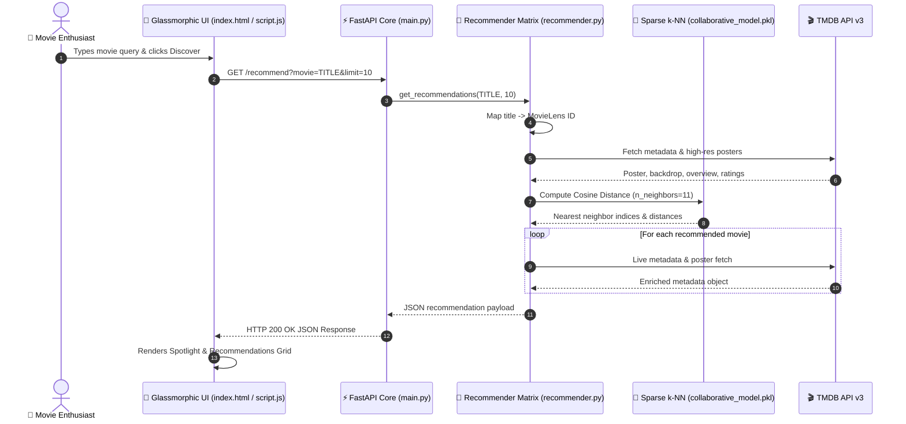

<div align="center">

# 🎬 CineMatch AI — Next-Gen Discovery Matrix

<a href="https://readme-typing-svg.herokuapp.com">
  
</a>

<br><br>

<a href="https://nersu-abhinav.github.io/CineMatch-AI/">
  
</a>
<a href="https://github.com/Nersu-Abhinav/CineMatch-AI/stargazers">
  
</a>
<a href="https://fastapi.tiangolo.com/">
  
</a>
<a href="https://scikit-learn.org/">
  
</a>
<a href="https://www.themoviedb.org/">
  
</a>

<br><br>

[ 🌐 **Live Web Application** ](https://nersu-abhinav.github.io/CineMatch-AI/) • [ ✨ **Core Features** ](#-cinematic-features) • [ 🏗️ **Architecture** ](#%EF%B8%8F-cyber-architecture) • [ 🛠️ **Tech Matrix** ](#%EF%B8%8F-tech-matrix) • [ 🚀 **Quick Start** ](#-quick-start)

---

</div>

> [!IMPORTANT]
> 🍿 **TRY THE LIVE APPLICATION**: Access the fully deployed glassmorphic web app directly in your browser at **[https://nersu-abhinav.github.io/CineMatch-AI/](https://nersu-abhinav.github.io/CineMatch-AI/)** — instant search & 4K poster enrichment!

---

## 🍿 The Cinematic Showcase

**CineMatch AI** is a state-of-the-art movie discovery platform engineered with **Item-Item Collaborative Filtering** ($k$-Nearest Neighbors across a 29+ million user rating matrix). It fuses high-dimensional vector similarity algorithms with **TMDB API v3** metadata to deliver hyper-personalized movie recommendations instantly.

<br>

<div align="center">

### 🎞️ Curated Discovery Spotlight

<table>
  <tr align="center">
    <td width="25%">
      <br><br>
      <b>Interstellar</b><br>
      <code>★ 8.4</code> • <code>Sci-Fi</code><br>
      <span style="color:#f5c518"><b>Vector Match: 98%</b></span>
    </td>
    <td width="25%">
      <br><br>
      <b>Inception</b><br>
      <code>★ 8.4</code> • <code>Action</code><br>
      <span style="color:#f5c518"><b>Vector Match: 96%</b></span>
    </td>
    <td width="25%">
      <br><br>
      <b>The Martian</b><br>
      <code>★ 7.7</code> • <code>Drama</code><br>
      <span style="color:#f5c518"><b>Vector Match: 95%</b></span>
    </td>
    <td width="25%">
      <br><br>
      <b>The Dark Knight</b><br>
      <code>★ 8.5</code> • <code>Action</code><br>
      <span style="color:#f5c518"><b>Vector Match: 99%</b></span>
    </td>
  </tr>
</table>

</div>

---

## ✨ Cinematic Features

<table width="100%">
  <tr>
    <td width="50%">
      <h3>🌌 Vector Space Similarity</h3>
      <p>High-dimensional cosine distance similarity vectors computed over 29M+ ratings using <code>scikit-learn</code> <code>NearestNeighbors(metric="cosine")</code>.</p>
    </td>
    <td width="50%">
      <h3>⚡ Sparse CSR Data Matrix</h3>
      <p>Memory-optimized chunked processing pipeline transforming raw rating datasets into compressed sparse CSR matrices without RAM overflow.</p>
    </td>
  </tr>
  <tr>
    <td width="50%">
      <h3>🖼️ TMDB Live 4K Metadata</h3>
      <p>Dynamic live fetching of high-res 4K backdrops, poster artwork, vote metrics, genre tags, and official synopses via TMDB API v3.</p>
    </td>
    <td width="50%">
      <h3>🎨 Glassmorphic Dark UI</h3>
      <p>State-of-the-art dark mode single-page application featuring glowing neon accents, dynamic backdrop blurs, and liquid smooth transitions.</p>
    </td>
  </tr>
  <tr>
    <td width="50%">
      <h3>💎 Chain Discovery Loop</h3>
      <p>Interactive 1-click discovery loop: click any movie card to instantly spawn fresh recommendations for that title on the fly.</p>
    </td>
    <td width="50%">
      <h3>🚀 1-Click PowerShell Launch</h3>
      <p>Includes an automated PowerShell launcher script (<code>start_project.ps1</code>) to start the API backend & UI frontend in parallel.</p>
    </td>
  </tr>
</table>

---

## 🏗️ Cyber Architecture



---

## 🛠️ Tech Matrix

| Component | Framework / Tool | Usage Description |
| :--- | :--- | :--- |
| **Backend API** | `FastAPI` + `Uvicorn` | Asynchronous REST endpoints, CORS handling, query parsing |
| **ML Machine** | `Scikit-Learn` + `SciPy` | Sparse CSR matrices, $k$-NN Cosine Similarity Indexing |
| **Data Processing** | `Pandas` + `NumPy` | Chunked processing of 29M+ MovieLens ratings |
| **Frontend App** | `HTML5` + `Vanilla JS` | In-memory state management, direct TMDB fallback engine |
| **UI Aesthetics** | `Vanilla CSS3` | Glassmorphism, Google Outfit typography, CSS Grid |
| **Data Provider** | `TMDB API v3` | High-res posters, backdrops, vote averages, synopses |

---

## 🚀 Quick Start

### 1. Environment Setup

```bash
# Clone the repository
git clone https://github.com/Nersu-Abhinav/CineMatch-AI.git
cd CineMatch-AI

# Create virtual environment
python -m venv venv

# Activate Virtual Environment (Windows)
.\venv\Scripts\activate
# Activate Virtual Environment (macOS/Linux)
source venv/bin/activate

# Install dependencies
pip install fastapi uvicorn pandas numpy scipy scikit-learn joblib requests python-dotenv
```

### 2. Configure TMDB API Key

Copy `.env.example` to `.env` and set your TMDB API Token:

```bash
cp .env.example .env
```

```env
TMDB_API_TOKEN=your_tmdb_read_access_token_here
```

### 3. Model Training & Launch

```bash
# 1. Filter raw ratings to top catalog items
python prepare_data.py

# 2. Train Collaborative Nearest-Neighbors Model
python train_collaborative.py
```

> [!TIP]
> **Windows PowerShell Users**: Run the 1-click launcher script to start backend & frontend simultaneously:
> ```powershell
> .\start_project.ps1
> ```

---

## 📁 Repository Structure

```
CineMatch-AI/
├── 📁 backend/
│   ├── main.py                # FastAPI routes & CORS setup
│   └── recommender.py         # 3-tier recommendation cascade engine
├── 📁 data/                      # MovieLens links & dataset files
├── 📁 frontend/
│   ├── index.html             # Application structure & glass layout
│   ├── script.js              # State engine & dynamic TMDB pipeline
│   └── style.css              # Custom dark-mode glassmorphic styling
├── 📁 model/                     # Serialized k-NN model artifacts (.pkl)
├── movie_metadata.py          # MovieLens ID to TMDB API bridge
├── prepare_data.py            # Chunked data filtering pipeline
├── recommend_collaborative.py # CLI recommendation test script
├── start_project.ps1          # 1-click Windows PowerShell launcher
├── tmdb.py                    # TMDB API v3 client wrapper
├── train_collaborative.py     # NearestNeighbors sparse model trainer
├── .env.example               # Environment variables template
└── README.md                  # Project documentation & reference
```

---

<div align="center">

## 🌟 Support & Feedback

If you enjoy using **CineMatch AI**, please consider giving this repository a ⭐ **Star** on GitHub!

<br>

<a href="https://github.com/Nersu-Abhinav/CineMatch-AI/stargazers">
  
</a>
<a href="https://github.com/Nersu-Abhinav/CineMatch-AI/network/members">
  
</a>

<br><br>

<a href="#top">
  
</a>

<br><br>

> *"Where we're going, we don't need ordinary algorithms."* 🍿

**Crafted with ❤️ for movie lovers worldwide.**

*Powered by MovieLens Datasets & TMDB API v3*

© 2026 **CineMatch AI**. Distributed under the [MIT License](LICENSE).

---

</div>
